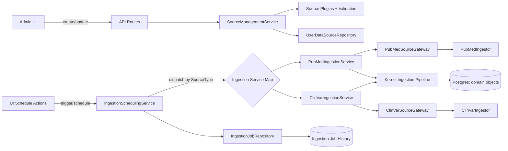

# Data Sources Architecture Guide

Last updated: 2026-02-13

This guide documents how MED13 currently handles external data sources and how to add new ones safely.

## Current Source Types

The system currently supports:

- `pubmed` (`SourceType.PUBMED`) and `clinvar` (`SourceType.CLINVAR`) as independent ingestion sources.
- `api`, `file_upload`, `database`, and `web_scraping` remain in the shared source model for future expansion.

`PubMed` and `ClinVar` are different upstream systems with different query contracts, response schemas, and query generation defaults, so they are treated as separate source types all the way down the stack.

## Architecture Overview

## Domain Contracts (Type-Safe and Source-Specific)

1. `SourceType` includes both `pubmed` and `clinvar` in:
   - `src/domain/entities/user_data_source.py`
2. Source-specific config models:
   - `src/domain/entities/data_source_configs/pubmed.py`
   - `src/domain/entities/data_source_configs/clinvar.py`
3. Source-specific plugins validate each source’s metadata:
   - `src/domain/services/source_plugins/plugins.py`
   - plugin registration in `src/domain/services/source_plugins/__init__.py`

## Ingestion Pipelines

The key architecture rule is:

- Source fetch and transform logic is source-specific.
- Scheduling, job tracking, extraction queue, and kernel ingestion are shared.

### PubMed ingestion path

- Scheduler dispatch: `SrcType -> _run_pubmed_ingestion`
  - `src/infrastructure/factories/ingestion_scheduler_factory.py`
- Source-specific service:
  - `src/application/services/pubmed_ingestion_service.py`
- Source connector:
  - `src/infrastructure/data_sources/pubmed_gateway.py`
- Ingestor:
  - `src/infrastructure/ingest/pubmed_ingestor.py`

### ClinVar ingestion path

- Scheduler dispatch: `SrcType -> _run_clinvar_ingestion`
  - `src/infrastructure/factories/ingestion_scheduler_factory.py`
- Source-specific service:
  - `src/application/services/clinvar_ingestion_service.py`
- Source connector:
  - `src/infrastructure/data_sources/clinvar_gateway.py`
- Ingestor:
  - `src/infrastructure/ingest/clinvar_ingestor.py`

## Shared Orchestration

`src/application/services/ingestion_scheduling_service.py` owns scheduling and execution:

1. Validates source state and status.
2. Creates `IngestionJob`.
3. Dispatches through `self._ingestion_services[source.source_type]`.
4. Stores run metadata in `job.metadata`.
5. Marks success/failure and updates source-level ingestion timestamp.

The protocol expected from each source service is:

- `src/domain/services/ingestion.py` (`IngestionRunSummary`) with common run counters and optional metadata.
- Source summary extras are allowed (e.g. PubMed `query_generation_*` fields in
  `src/domain/services/pubmed_ingestion.py`).

## AI Test Flow Is Shared, But Connector Execution Is Not

The Configure AI test flow is shared, but connector selection is conditional:

1. `DataSourceAiTestService` (`src/application/services/data_source_ai_test_service.py`) generates an AI query.
2. Connector branch is selected in helpers:
   - `src/application/services/data_source_ai_test_helpers.py`
   - `should_use_pubmed_gateway(...)`
   - `should_use_clinvar_gateway(...)`
3. Matching connector fetches test records:
   - `pubmed` -> `PubMedSourceGateway`
   - `clinvar` -> `ClinVarSourceGateway`

This means:
- AI generation can be configured per source through `AiAgentConfig`.
- Actual data retrieval still goes through the source-specific connector and its own config contract.

## Current Observability and Run History

Current run trail is stored in `IngestionJob` and `ingestion_jobs` table:

- `IngestionJob` domain and `src/models/database/ingestion_job.py` SQLAlchemy model.
- `source_config_snapshot` preserves the exact config for that run.
- `job_metadata` stores details like query, query-generation metadata, and extraction context.
- idempotency metadata is now standardized in one typed contract:
  - `IngestionIdempotencyMetadata` in `src/type_definitions/data_sources.py`
  - serialized into `job.metadata["idempotency"]` by `src/application/services/ingestion_scheduling_service.py`
- History API endpoint:
  - `src/routes/admin_routes/data_sources/history.py`
  - response schema now includes `executed_query` and typed `idempotency` in
    `src/routes/admin_routes/data_sources/schemas.py`
- History UI now shows checkpoint and idempotency counters in:
  - `src/web/components/data-sources/DataSourceIngestionDetailsDialog.tsx`
- Incremental checkpoint state table/model:
  - `source_sync_state` / `src/models/database/source_sync_state.py`
- Record fingerprint ledger table/model:
  - `source_record_ledger` / `src/models/database/source_record_ledger.py`

### Current status and limitations

`IngestionSchedulingService` now reads/writes `source_sync_state` and passes
ledger context to source ingestion services. PubMed/ClinVar ingestion now uses
`source_record_ledger` to skip unchanged records before pipeline processing.

Implemented in this phase:
- typed metadata envelope for all scheduler-owned `IngestionJob.metadata` sections:
  - `executed_query`
  - `query_generation`
  - `idempotency`
  - `extraction_queue`
  - `extraction_run`
- checkpoint/idempotency exposure in history API with typed parsing and compatibility fallback.
- checkpoint/idempotency rendering in admin ingestion history UI.
- retry-safe deduplication before pipeline processing (new vs updated vs unchanged).
- source-specific incremental fetch semantics in gateways (`fetch_records_incremental`).
- native cursor checkpoint semantics end-to-end for PubMed and ClinVar:
  - provider cursor payloads (`retstart`/`retmax` + cycle metadata)
  - `checkpoint_kind=cursor` persisted in `source_sync_state`
  - checkpoint kind included in typed idempotency metadata.

## Run Tracking Persistence Boundaries

The platform now includes these two persistence boundaries:

### 1) Source Sync State (`source_sync_state`)

Track the last successful checkpoint per source and query contract:

- `source_id` (FK to `user_data_sources.id`, unique)
- `source_type`
- `checkpoint_kind` (`none`, `cursor`, `timestamp`, `external_id`)
- `checkpoint_payload` (JSON)
- `query_signature` (hash of normalized query/config)
- `last_successful_job_id`
- `last_successful_run_at`
- `last_attempted_run_at`
- optional `upstream_etag`, `upstream_last_modified`
- `created_at`, `updated_at`

### 2) Source Record Ledger (`source_record_ledger`)

Track external IDs and payload fingerprints for idempotent re-runs:

- `source_id`, `external_record_id` (unique with source_id)
- `last_seen_job_id`
- `first_seen_job_id`
- `payload_hash`
- `source_updated_at` (if provided)
- `ingested_at`

## Suggested Idempotent Run Algorithm

1. Start run:
   - load sync state by `source_id`.
   - compute `query_signature` and compare against previous run.
2. Fetch records from connector using:
   - source-specific checkpoint semantics if supported (`cursor`, date window, etc.)
3. For each upstream record:
   - map to stable `external_record_id`.
   - compute deterministic `payload_hash`.
4. Skip records with same `(external_record_id, payload_hash)` as ledger.
5. Process only new/changed records through shared pipeline.
6. Persist:
   - updated ledger rows
   - sync checkpoint if run succeeds
   - detailed counters in job metadata:
     - `fetched_records`
     - `new_records`
     - `updated_records`
     - `unchanged_records`
     - `skipped_records`
     - checkpoint before/after and query signature.
7. Only advance checkpoint on successful run.

## New Source Onboarding Checklist

For each new `SourceType.X`:

1. Add enum in domain (`SourceType`) and DB enum/model where required.
2. Create `XQueryConfig` model in `src/domain/entities/data_source_configs/`.
3. Add plugin validator in `src/domain/services/source_plugins/plugins.py`.
4. Add domain service contract protocol if needed (`src/domain/services/...`).
5. Add gateway interface implementation in `src/infrastructure/data_sources/`.
6. Add `XIngestionService` in `src/application/services/`.
7. Wire scheduler map in `src/infrastructure/factories/ingestion_scheduler_factory.py`.
8. Add source-specific AI test branching rules in:
   - `src/application/services/data_source_ai_test_helpers.py`
   - `src/application/services/data_source_ai_test_service.py`
9. Add/extend tests in:
   - unit: service/runner/plugin contract
   - integration: repository + scheduled run + history persistence
10. Expose/adjust UI schema and forms for create/edit + defaults.
11. Add sync/ledger repositories and use them in scheduling service before/after run.

## Version 2 Status

All Version 2 architecture gaps are implemented:

1. Stable run metadata schema in `IngestionJob.metadata`.
   - Implemented via `IngestionJobMetadata` typed envelope.
2. Source-level checkpoints exposed in ingestion history API/UI.
   - Implemented via typed `idempotency` metadata and rendered in ingestion details.
3. Retry-safe resume logic to avoid reprocessing unchanged records.
   - Implemented via `source_record_ledger` hash-based dedup before pipeline execution.
4. Source-specific cursor semantics for providers with native cursors.
   - Implemented for PubMed and ClinVar with provider cursor payloads persisted in
     `source_sync_state`.

## Remaining Gaps (Post-V2 Hardening)

No blocking architecture gaps remain for PubMed/ClinVar independence and schedulable ingestion.

Optional hardening items for future iterations:

1. Add retention/compaction policy for `source_record_ledger` growth over long-running sources.
2. Add explicit per-source concurrency guards (for overlapping manual + scheduled runs).
3. Add richer operational telemetry/alerts for checkpoint resets and dedup ratios.
4. Extend typed metadata contract adoption to any non-scheduler metadata writers, if introduced.

## Principles to Keep

1. Keep source plugins, ingestors, gateways, and ingestion services source-specific.
2. Keep orchestration, job lifecycle, queueing, and kernel pipeline shared.
3. Keep domain free of framework-specific details; move I/O to infrastructure.
4. Preserve strict typing; avoid `Any` outside constrained infrastructure exceptions.
