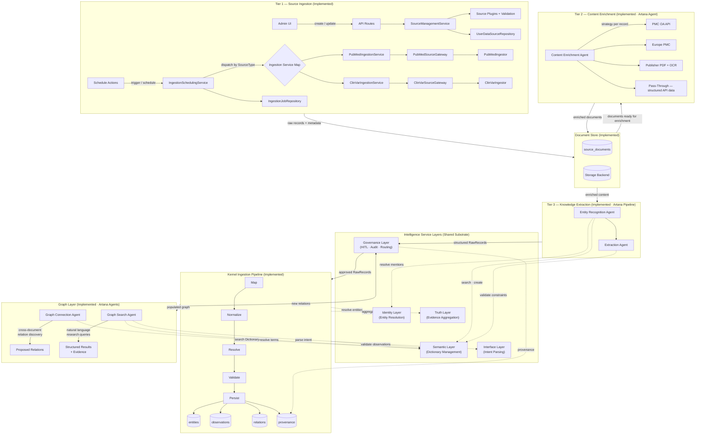
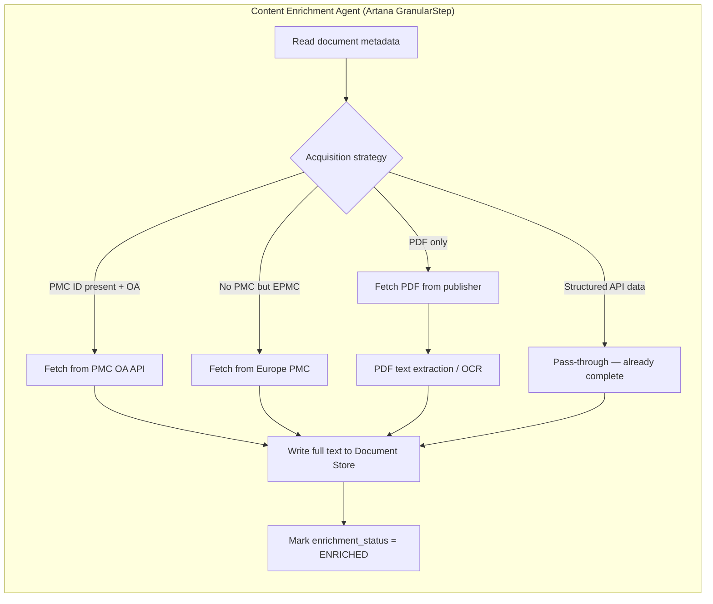
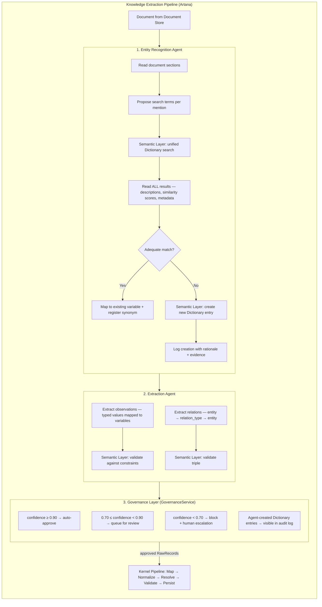
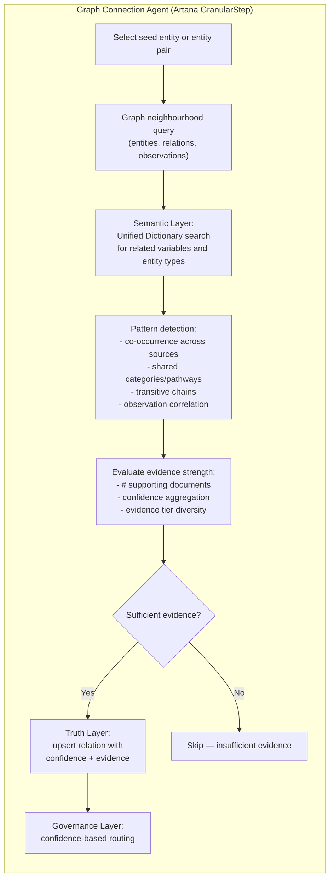
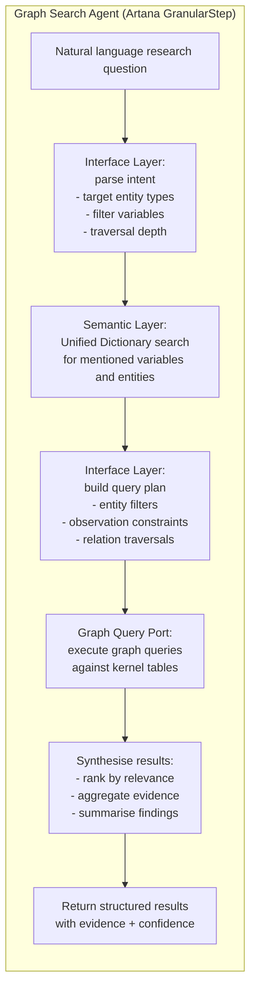

# Data Sources Architecture Guide

Last updated: 2026-02-16

This guide documents how the platform handles external data sources end-to-end
— from discovery and fetch through content enrichment, knowledge extraction,
and graph persistence — across **any domain**.  The architecture is
domain-agnostic: the same pipeline, agents, and kernel graph serve biomedical
research (MED13, ClinVar), sports analytics (MLB statistics), CS benchmarking,
or any other domain.  Only the Dictionary content differs.

It covers both the **implemented** source ingestion infrastructure (currently
deployed for PubMed and ClinVar as the first domain connectors) and the
**implemented** Artana-agent-driven extraction pipeline stages from raw
upstream data toward the kernel knowledge graph.  The staged components are
implemented end-to-end for the currently supported connectors; remaining
flow deltas are tracked in "Known Gaps vs Flow Example".

---

## Table of Contents

1. [Current Source Types](#current-source-types)
2. [End-to-End Architecture Overview](#end-to-end-architecture-overview)
3. [Intelligence Service Layers](#intelligence-service-layers)
4. [Tier 1 — Source Ingestion Pipeline (Implemented)](#tier-1--source-ingestion-pipeline-implemented)
5. [Tier 2 — Content Enrichment Pipeline (Implemented)](#tier-2--content-enrichment-pipeline-implemented)
6. [Tier 3 — Knowledge Extraction Pipeline (Implemented)](#tier-3--knowledge-extraction-pipeline-implemented)
7. [The Document Store (Implemented)](#the-document-store-implemented)
8. [Kernel Ingestion Pipeline (Implemented)](#kernel-ingestion-pipeline-implemented)
9. [Domain Contracts](#domain-contracts-type-safe-and-source-specific)
10. [Ingestion Pipelines](#ingestion-pipelines)
11. [Shared Orchestration](#shared-orchestration)
12. [AI Test Flow](#ai-test-flow-is-shared-but-connector-execution-is-not)
13. [Current Observability and Run History](#current-observability-and-run-history)
14. [Run Tracking Persistence Boundaries](#run-tracking-persistence-boundaries)
15. [Suggested Idempotent Run Algorithm](#suggested-idempotent-run-algorithm)
16. [New Source Onboarding Checklist](#new-source-onboarding-checklist)
17. [Version 2 Status](#version-2-status)
18. [Post-V2 Hardening Status](#post-v2-hardening-status)
19. [The Knowledge Graph (Implemented)](#the-knowledge-graph-implemented)
20. [Graph Connection Generation — Artana Agent (Implemented)](#graph-connection-generation--artana-agent-implemented)
21. [Graph Search — Artana Agent (Implemented)](#graph-search--artana-agent-implemented)
22. [PHI Isolation & Security](#phi-isolation--security)
23. [Multi-Tenancy — Research Spaces](#multi-tenancy--research-spaces)
24. [Autonomous Dictionary Evolution Plan](#autonomous-dictionary-evolution-plan)
25. [Known Gaps vs Flow Example](#known-gaps-vs-flow-example)
26. [Gap Closure Checklist](#gap-closure-checklist)
27. [Principles to Keep](#principles-to-keep)

---

## Current Source Types

The platform is designed to ingest data from **any source type** in any domain.
Each source type has its own connector, config, and query contract, while
scheduling, job lifecycle, dedup, and the kernel pipeline are shared.

**Currently implemented connectors:**

- `pubmed` (`SourceType.PUBMED`) — biomedical literature search and MEDLINE XML retrieval.
- `clinvar` (`SourceType.CLINVAR`) — genomic variant classification records.

**Available but not yet connected:**

- `api` — generic REST/GraphQL API connector (e.g. ESPN stats API, OpenAlex, GBIF).
- `file_upload` — CSV, JSON, or Excel uploads (e.g. batting statistics, lab results, benchmark scores).
- `database` — direct database connector (e.g. institutional data warehouse, REDCap export).
- `web_scraping` — structured web extraction (e.g. trade trackers, leaderboard pages).

Adding a new domain requires a new connector and domain Dictionary
definitions — no changes to the pipeline, agents, or kernel graph.
Graph-stage seed IDs are resolved at runtime (explicit request seeds,
extraction-derived seeds, or AI-inferred seeds from project/run context).
PubMed and ClinVar are treated as separate source types because they have
different upstream APIs, response schemas, and query contracts — the same
pattern any new connector follows.

---

## End-to-End Architecture Overview

The platform is organised into three sequential **tiers** that feed into a
knowledge graph, plus two **graph-layer agents** that operate on the graph
itself.  Each tier has a clear input, a clear output, and a well-defined
boundary that separates it from the next.  The tier pipeline and graph-layer
agents are implemented end-to-end.



### Tier boundaries

| Boundary | From | To | Medium |
|---|---|---|---|
| Tier 1 → Document Store | Source ingestion services | `source_documents` table + blob storage | Raw JSON/XML persisted via `StorageUseCase.RAW_SOURCE`; document record created |
| Document Store → Tier 2 | Document Store queue | Content Enrichment Agent | Documents with `enrichment_status = PENDING` |
| Tier 2 → Document Store | Content Enrichment Agent | Document Store | Full-text content written to blob; `enrichment_status = ENRICHED` |
| Document Store → Tier 3 | Document Store queue | Knowledge Extraction Pipeline | Enriched documents with `extraction_status = PENDING` |
| Tier 3 → Governance Layer | Extraction Agent output | `GovernanceService.evaluate()` | Agent contract outputs routed by confidence (auto-approve / review / block) |
| Governance Layer → Kernel | Governance Layer approved output | `IngestionPipeline.run()` | Typed `RawRecord` objects ready for Map → Normalize → Resolve → Validate |
| Kernel → Graph Layer | Persisted graph data | Graph Connection Agent / Graph Search Agent | Agents query `entities`, `observations`, `relations` via scoped tools; Dictionary access via Semantic Layer |
| Graph Layer → Governance Layer | Graph Connection Agent output | `GovernanceService.evaluate()` | Proposed relations routed by confidence |
| Governance Layer → Kernel | Governance Layer approved relations | `relations` table via canonical upsert | New `DRAFT` relations with `evidence_tier = COMPUTATIONAL` |

---

## Intelligence Service Layers

The platform's intelligence is organized into **five centralized service
layers** that sit alongside — not inside — the Tiers and Graph Agents.  Every
agent, pipeline stage, and admin endpoint consumes these layers through clean
**Ports** (interfaces defined in the domain layer, implementations in
infrastructure).  No agent reimplements search, resolution, validation,
governance, or provenance logic — it delegates to the appropriate layer.

This separation is the key architectural decision that keeps agents **thin
orchestrators** while the intelligence layers form a **reusable, auditable,
evolvable substrate**.

### Layer overview

```
┌─────────────────────────────────────────────────────────────────────────┐
│                    Intelligence Service Layers                          │
│                                                                         │
│  ┌──────────────┐  ┌──────────────┐  ┌──────────────┐                  │
│  │  1. Semantic  │  │ 2. Identity  │  │   3. Truth   │                  │
│  │    Layer      │  │    Layer     │  │    Layer     │                  │
│  │  (Dictionary) │  │ (Resolution) │  │  (Evidence)  │                  │
│  └──────┬───────┘  └──────┬───────┘  └──────┬───────┘                  │
│         │                 │                  │                           │
│  ┌──────────────┐  ┌──────────────┐                                     │
│  │ 4. Governance│  │ 5. Interface │                                     │
│  │    Layer     │  │    Layer     │                                     │
│  │ (HITL/Audit) │  │   (Intent)  │                                     │
│  └──────┬───────┘  └──────┬───────┘                                     │
└─────────────────────────────────────────────────────────────────────────┘
              ▲               ▲               ▲
              │               │               │
    ┌─────────┴───┐   ┌──────┴─────┐   ┌─────┴──────┐
    │ Tier 3      │   │ Kernel     │   │ Graph      │
    │ Agents      │   │ Pipeline   │   │ Agents     │
    └─────────────┘   └────────────┘   └────────────┘
```

### 1. Semantic Layer — Dictionary Management

**Application Service:** `DictionaryManagementService`
**Port:** `DictionaryPort` (domain layer)

The single source of truth for all Dictionary operations across the four
dimensions: **variables**, **entity types**, **relation types**, and
**constraints**.

**Deterministic core (90% of calls):**

- `search(terms, dimensions, filters)` — unified search: exact/synonym → fuzzy
  (trigram) → vector (pgvector on description embeddings).  Returns ranked
  results with full metadata, match method, and similarity score.
- `search_by_domain(domain_context, limit)` — list definitions in a domain
  across all dimension tables.
- `create_variable(...)` / `create_entity_type(...)` / `create_relation_type(...)`
  / `create_relation_constraint(...)` — validated creation with provenance,
  embedding computation, and immediate usability.
- `create_synonym(...)` — register synonyms for faster future exact-match.
- `validate_observation(variable_id, value, unit)` — check against variable
  constraints and preferred unit.
- `validate_triple(source_type, relation_type, target_type)` — check against
  `relation_constraints`.
- `revoke(id, reason)` / `set_review_status(id, status, reviewed_by)` —
  governance lifecycle.

**Agent overlay (10% — reasoning-heavy operations):**

- Suggest variables for a text passage (Entity Recognition Agent).
- Propose merge of near-duplicate definitions.
- Bootstrap Dictionary content for a brand-new domain (cold-start).
- Decide whether a novel concept matches an existing entry or requires a new one.

**Consumers:** Entity Recognition Agent, Extraction Agent, Graph Connection
Agent, Graph Search Agent, Kernel Pipeline (Map + Validate stages), Admin UI.

### 2. Identity Layer — Entity Resolution

**Application Service:** `EntityResolutionService`
**Port:** `EntityResolutionPort` (domain layer)

Centralizes the logic for mapping raw mentions to kernel `entities` — the
"who/what is this?" question.

**Deterministic core:**

- `resolve(anchor, entity_type, research_space_id)` — match subject anchors to
  existing entities via `entity_resolution_policies`; create new entities when
  allowed.  Currently implemented by `EntityResolver` in the Kernel Pipeline.
- `merge(entity_id_a, entity_id_b, reason)` — merge two entities that are
  determined to be the same (re-link observations, relations, provenance).
- `split(entity_id, criteria)` — split an erroneously merged entity.

**Agent overlay (ambiguous resolution):**

- When the deterministic resolver produces a low-confidence match (e.g. fuzzy
  name match across variant nomenclatures), an LLM Judge mapper decides.
- The `HybridMapper` chain (`ExactMapper` → `VectorMapper` → `LLMJudgeMapper`)
  is the agent overlay — it calls the Identity Layer's deterministic core first
  and escalates to the LLM only for ambiguous cases.

**Consumers:** Kernel Pipeline (Resolve stage), Entity Recognition Agent (when
it creates entities), Graph Connection Agent (when it proposes relations between
entities that may need resolution).

### 3. Truth Layer — Evidence & Consensus Aggregation

**Application Service:** `EvidenceAggregationService`
**Port:** `EvidenceAggregationPort` (domain layer)

Centralizes the logic for computing aggregate confidence, evidence tiering, and
auto-promotion over claim-backed projected relations. Canonical relation writes
flow through projection materialization, and `relation_evidence` is maintained
as a derived cache from support-claim evidence rather than an independent truth
store.

**Deterministic core (no agent overlay — pure computation):**

- `aggregate_confidence(evidence_items)` — compute
  `1 - ∏(1 - evidence_i.confidence)`.
- `compute_highest_tier(evidence_items)` — determine
  `EXPERT_CURATED > CLINICAL > EXPERIMENTAL > LITERATURE > COMPUTATIONAL`.
- `should_auto_promote(relation)` — evaluate configurable thresholds
  (e.g. `source_count >= 3` AND `aggregate_confidence >= 0.95`).
- `rebuild_projected_relation_evidence(relation_id)` — rebuild derived
  `relation_evidence` from linked support-claim evidence, recompute aggregate,
  and trigger auto-promotion if thresholds are met.

**Consumers:** Kernel Pipeline (Persist stage — relation upserts), Graph
Connection Agent (when proposing new relations), Admin UI (displaying evidence
strength).

### 4. Governance Layer — HITL, Audit & Routing

**Application Service:** `GovernanceService`
**Port:** `GovernancePort` (domain layer)

Centralizes confidence-based routing, review queue management, PHI scrubbing,
cost limits, and provenance recording.  Extends the existing `GovernanceConfig`
(already in `src/infrastructure/llm/config/governance.py`) into a full
Application Service with endpoints.

**Deterministic core:**

- `evaluate(contract: BaseAgentContract) -> GovernanceDecision` — apply
  confidence thresholds:
  - `≥ 0.90` → auto-approve → forward to downstream.
  - `0.70 – 0.89` → forward + queue for post-hoc review.
  - `< 0.70` → block → human escalation.
  - Agent-created Dictionary entries → forward immediately + log to audit view.
- `record_provenance(source_type, source_ref, extraction_run_id, ...)` —
  unified provenance recording for every decision.
- `queue_for_review(item, reason)` — add to the centralized review queue.
- `get_review_queue(filters)` — single queue for curators covering all agent
  outputs (Dictionary creations, extractions, graph connections).
- `is_tool_allowed(tool_id)` / `check_cost_limits(usage)` — existing governance
  checks.

**Agent overlay:** None initially — governance is deterministic.  A future
"Governance Advisor" agent could suggest threshold adjustments based on
historical accuracy.

**Consumers:** Tier 3 (output routing), Graph Connection Agent (output routing),
Graph Search Agent (evidence attribution), Admin UI (review queue, audit trail),
all agents (cost limit checks).

### 5. Interface Layer — Intent Parsing

**Application Service:** `ResearchQueryService`
**Port:** `ResearchQueryPort` (domain layer)

Centralizes the translation of natural-language research questions into
structured query plans that span the graph and Dictionary.

**Agent-powered (this layer is primarily reasoning):**

- `parse_intent(question, research_space_id)` — decompose a natural-language
  question into target entity types, filter variables, traversal depth, and
  aggregation needs.
- `resolve_terms(terms, domain_context)` — map vague terms ("cardiac
  phenotypes", "batting stats") to specific Dictionary variables via the
  Semantic Layer.
- `build_query_plan(intent)` — translate parsed intent into graph query
  operations.
- `execute_and_synthesize(plan)` — run queries and produce ranked results with
  evidence.

**Consumers:** Graph Search Agent (primary consumer), Admin UI (research query
interface), future programmatic APIs.

### Architectural principles for the layers

1. **Logical centralization first, physical later.** Each layer is an
   Application Service in the same repository.  No microservice overhead.
   Services communicate in-process via Ports.  If a layer needs to become a
   separate service later, the Port boundary makes that straightforward.

2. **Deterministic core + optional Agent overlay.** Most operations (search,
   validate, aggregate, route) are deterministic.  LLM agents are used only
   for the minority of calls that require reasoning (ambiguous resolution,
   term suggestion, cold-start bootstrapping).  This keeps costs low and
   latency predictable.

3. **Agents are thin orchestrators.** A Tier 3 agent reads a document, calls
   the Semantic Layer to search/create, calls the Identity Layer to resolve
   entities, and emits a contract.  The Governance Layer routes the output.
   The agent does not reimplement any of these — it composes layer calls.

4. **One audit surface.** All provenance, review queues, and cost tracking
   flow through the Governance Layer.  Curators see a single review queue
   regardless of which agent or pipeline produced the item.

5. **Cache-friendly.** The Semantic Layer caches embedding lookups and
   exact-match results.  The Identity Layer caches resolved entities within a
   pipeline run.  This prevents the centralized layers from becoming
   performance bottlenecks.

---

## Tier 1 — Source Ingestion Pipeline (Implemented)

Tier 1 is responsible for **discovering, fetching, deduplicating, and persisting
raw records** from external sources.  It is fully implemented and documented in
the sections below (Domain Contracts, Ingestion Pipelines, Shared Orchestration,
Observability, Run Tracking, Idempotent Run Algorithm).

Key characteristics:

- **Deterministic** — no AI reasoning; source connectors and plugins are pure
  data-fetch + validation logic.
- **Source-specific** — each `SourceType` has its own gateway, ingestor, config,
  and plugin.  Scheduling, job lifecycle, and dedup are shared.
- **Outputs** — raw records persisted to `StorageUseCase.RAW_SOURCE` and queued
  in the extraction queue.  When a research space is set, records are also
  forwarded to the kernel ingestion pipeline for immediate structured ingestion.

What Tier 1 does **not** do:

- It does not fetch full-text or enriched content beyond what the upstream API
  provides.  For example, PubMed ingestion retrieves MEDLINE XML (titles,
  abstracts, structured metadata — not paper bodies); a CSV upload provides
  tabular rows but no narrative context.
- It does not perform deep knowledge extraction.  The current
  `RuleBasedPubMedExtractionProcessor` applies regex patterns to
  title+abstract for structured identifiers.  This is a useful baseline for
  biomedical data but does not generalise to other domains.

These limitations are specific to the current connectors.  Tiers 2 and 3 fill
these gaps with domain-agnostic, agent-driven enrichment and extraction.

---

## Tier 2 — Content Enrichment Pipeline (Implemented)

### Problem

Different sources provide different levels of content.  PubMed gives metadata
and abstracts; ClinVar gives structured variant records; a CSV upload gives
tabular rows; a web scrape gives HTML fragments.  Some sources lack the **full
narrative or structured content** (paper body text, supplementary tables,
complete API payloads) that a Knowledge Extraction agent needs to build the
graph.

### Solution — Content Enrichment Agent (Artana)

A **Artana agent** that runs asynchronously after Tier 1 completes.  For each
document record in the Document Store with `enrichment_status = PENDING`, the
agent decides *how* to acquire full content and executes the acquisition.



#### Why a Artana agent

Content acquisition is a **judgment call per record**, not a deterministic rule:

- Is this an open-access paper?  Check PMC OA list.
- Does Europe PMC have a full-text XML version?
- Is the PDF from a publisher that allows text mining?
- Should we skip enrichment for records where the abstract alone is sufficient
  (e.g. conference abstracts with no full text)?

These decisions require contextual reasoning and benefit from confidence scoring
and evidence-first outputs (via `BaseAgentContract`).

#### Artana primitives

| Concern | Primitive | Rationale |
|---|---|---|
| Per-document acquisition strategy | `GranularStep` (ReAct) | Multi-turn: inspect metadata, try sources in order, handle failures |
| Batch orchestration | Standard `Step` | Simple loop over pending documents with rate-limit awareness |

#### Contract sketch

```python
class ContentEnrichmentContract(BaseAgentContract):
    """Output contract for the Content Enrichment Agent."""

    document_id: UUID
    acquisition_method: Literal[
        "pmc_oa", "europe_pmc", "publisher_pdf", "pass_through", "skipped"
    ]
    content_format: Literal["xml", "text", "pdf_extracted", "structured_json"]
    content_storage_key: str | None  # blob key in Document Store
    content_length_chars: int
    decision: Literal["enriched", "skipped", "failed"]
    # Inherited: confidence_score, rationale, evidence
```

#### Rate limiting and ethics

- Respect publisher rate limits and robots.txt.
- Never circumvent paywalls; only fetch content permissible under text-mining
  agreements (e.g. PMC OA, Europe PMC, CORE, Unpaywall).
- Log every acquisition decision in provenance for audit.

---

## Tier 3 — Knowledge Extraction Pipeline (Implemented)

### Problem

The current extraction path (`ExtractionRunnerService` +
`RuleBasedPubMedExtractionProcessor`) applies regex patterns to title+abstract.
This works for structured identifiers in a known domain but cannot:

- Map natural-language mentions to Dictionary entries across any domain
  (e.g. "enlarged heart" → `HP:0001640`, or "batting average" → `VAR_BATTING_AVERAGE`).
- Recognise whether a passage describes a factual association vs. a hypothesis.
- Decide whether a novel concept corresponds to an existing Dictionary entry
  or requires a new one — for variables, entity types, or relation types.
- Extract typed triples (entity → relation → entity) with evidence and
  confidence from unstructured or semi-structured content.
- Bootstrap Dictionary content for a **brand new domain** where no entries
  exist yet (e.g. a sports analytics source or a CS benchmarking dataset).

These are **reasoning tasks** — exactly what Artana agents with contracts and
evidence-first outputs are designed for.

### Solution — Artana Knowledge Extraction Pipeline

A Artana pipeline with two agents and a deterministic governance gate that reads
enriched documents from the Document Store and produces typed `RawRecord`
objects for the kernel ingestion pipeline.



### Agent details

#### 1. Entity Recognition Agent

**Purpose:** Identify all entity mentions and variable references in a document
and map them to the Master Dictionary.  When a mention does not match any
existing definition, the agent **creates the new Dictionary entry autonomously**
following a standardised schema, then immediately uses it for mapping.

**Artana primitive:** `GranularStep` (ReAct pattern) — the agent reads text
sections, proposes search terms, evaluates results, and either maps to an
existing definition or creates a new one.

**Search-then-decide workflow**

The agent does not make blind single-term lookups.  Instead it follows a
deliberate **propose → read → decide** cycle for each entity or variable
mention it encounters in the document:

```
1. PROPOSE SEARCH TERMS
   The agent reads a text span and generates a list of candidate search
   terms — the literal mention, plausible synonyms, related ontology labels,
   and normalised forms.
   Example: text says "enlarged heart"
            → search terms: ["enlarged heart", "cardiomegaly",
                             "cardiac enlargement", "HP:0001640"]

2. UNIFIED DICTIONARY SEARCH (exact + synonym + vector)
   The agent calls `dictionary_search(terms)` which runs THREE matching
   strategies in a single call and merges the results:

     a) Exact / synonym match — direct lookup against canonical names
        and the variable_synonyms table.
     b) Fuzzy text match — prefix / trigram search on canonical names
        and synonyms.
     c) Vector similarity on descriptions — pgvector cosine similarity
        against embeddings of the `description` column.  This catches
        semantic matches that text search misses (e.g. "enlarged heart"
        matches a description that says "enlargement of the cardiac
        chambers" even though no synonym was registered).

   For every matching variable the tool returns:
     • id, canonical_name, display_name
     • description  (full prose — the agent reads this)
     • data_type, preferred_unit, constraints
     • domain_context, sensitivity
     • match_method  ("exact", "synonym", "fuzzy", "vector")
     • similarity_score  (1.0 for exact; cosine similarity for vector)

   Results are ranked: exact > synonym > fuzzy > vector.  The agent sees
   all of them in one response.

3. READ AND EVALUATE RESULTS
   The agent reads the returned descriptions and metadata.  It reasons
   about which existing variable (if any) is the correct semantic match
   for the text mention, considering:
     • Does the description match the meaning in context?
     • Is the similarity_score high enough to trust?
     • Is the data_type compatible with the value being extracted?
     • Is the domain_context appropriate?
     • Are there near-duplicates that should be preferred over creating
       a new entry?
     • If the best match is a vector hit — does reading its full
       description confirm it is the same concept, or is it a false
       positive?

4. DECIDE
   a) MATCH FOUND — map the mention to the existing variable.
      Register the original text as a new synonym so future runs
      resolve instantly via exact match (no vector search needed).
   b) NO ADEQUATE MATCH — create a new Dictionary entry using the
      standardised creation schema, register the original text as a
      synonym, and use the new entry for mapping.
```

This cycle repeats for every distinct mention in the document.  Because the
agent sees exact matches **and** semantically similar descriptions side by
side — with full prose and similarity scores — it can make strongly informed
decisions and avoid creating duplicates.

**Tools available (provided by Intelligence Service Layers):**

The Entity Recognition Agent can search and extend **all four Dictionary
dimensions** — variables, entity types, relation types, and constraints.
This makes the Dictionary a **universal schema engine**: the agent fills in
domain-specific content on the fly for any domain (genomics, clinical,
sports, CS benchmarking) without code changes.

All tools below delegate to the **Semantic Layer** (`DictionaryManagementService`)
and the **Identity Layer** (`EntityResolutionService`).  The agent does not
reimplement search, validation, or creation logic — it composes calls to these
centralized services.

- `dictionary_search(terms: list[str], dimensions: list[str] | None)` —
  **Semantic Layer** · unified search across **all Dictionary dimensions**:
  `variable_definitions`, `variable_synonyms`, `dictionary_entity_types`,
  `dictionary_relation_types`, and `relation_constraints`.  Uses three
  strategies in one call: exact/synonym match, fuzzy text match, and
  **pgvector cosine similarity on description embeddings**.  Returns matching
  entries with their **full metadata, descriptions, match method, and
  similarity score** so the agent can evaluate semantic fit.  Results are
  ranked by match quality (exact > synonym > fuzzy > vector).  The optional
  `dimensions` parameter filters to specific tables
  (e.g. `["variables"]`, `["relation_types"]`); when omitted, all dimensions
  are searched.
- `dictionary_search_by_domain(domain_context: str, limit: int)` —
  **Semantic Layer** · list existing definitions in a domain across all
  Dictionary tables.  Used by the agent to learn naming conventions, existing
  entity types, relation types, and constraint patterns before creating new
  entries.
- `create_variable(...)` — **Semantic Layer** · create a new variable
  definition in the Dictionary.  The agent must populate every required field
  following the standardised creation schema (see below).  The Semantic Layer
  validates the entry, computes its embedding, records provenance, and makes
  it immediately usable as a mapping target.
- `create_synonym(variable_id, synonym, source)` — **Semantic Layer** ·
  register a new synonym for an existing or just-created variable.
- `create_entity_type(entity_type, description, resolution_policy,
  required_anchors, domain_context)` — **Semantic Layer** · register a new
  entity type with its resolution policy.  The agent must provide a clear
  `description` of what the entity type represents and the `domain_context`
  it belongs to.
- `create_relation_type(relation_type, description, is_directional,
  domain_context)` — **Semantic Layer** · create a new relation type in
  `dictionary_relation_types`.  The agent must provide the semantics of the
  relationship, whether it is directional (A→B differs from B→A), and its
  domain context.  The entry becomes immediately usable in constraints and
  extractions.
- `create_relation_constraint(source_type, relation_type, target_type,
  requires_evidence)` — **Semantic Layer** · register a new allowed triple
  pattern in `relation_constraints`.  The agent creates this after ensuring
  the source entity type, relation type, and target entity type already exist
  (or were just created).  The constraint becomes immediately active for
  validation.

**Standardised Dictionary Creation Schema**

The Dictionary is self-describing: every `variable_definition` carries a full
`description`, typed constraints, and domain context — giving the agent enough
information to understand what each variable represents and to create new
entries that are consistent with existing ones.  When the agent creates a new
entry it must supply **all** of the following fields:

| Field | Type | Agent responsibility |
|---|---|---|
| `id` | `STRING(64)` | Generate a stable, prefixed ID (e.g. `VAR_SYSTOLIC_BP`). Convention: `VAR_` + `UPPER_SNAKE_CASE`. |
| `canonical_name` | `STRING(128)` | Snake-case unique name (e.g. `systolic_bp`). Must not collide with existing names. |
| `display_name` | `STRING(255)` | Human-readable label (e.g. "Systolic Blood Pressure"). |
| `data_type` | `ENUM` | One of: `INTEGER`, `FLOAT`, `STRING`, `DATE`, `CODED`, `BOOLEAN`, `JSON`. Inferred from the data. |
| `preferred_unit` | `STRING(64)` or `NULL` | UCUM-standard unit if applicable (e.g. `mmHg`). |
| `constraints` | `JSONB` | Validation bounds (e.g. `{"min": 0, "max": 300}`). Agent infers from domain context. |
| `domain_context` | `STRING(64)` | Domain tag — agent-extensible: `clinical`, `genomics`, `sports`, `cs_benchmarking`, `general`, or any new domain the agent creates. |
| `sensitivity` | `ENUM` | `PUBLIC`, `INTERNAL`, or `PHI`. Default `INTERNAL` unless clearly public data. |
| `description` | `TEXT` | A clear, concise explanation of what this variable represents, its measurement context, and any relevant ontology references. |

The agent uses the existing Dictionary entries as **exemplars**: it reads
definitions in the same `domain_context` to learn the naming conventions,
constraint patterns, and description style, then creates new entries that
follow the same patterns.

**Synonym registration:** When creating a new variable, the agent also
registers the original term from the source document as a `variable_synonym`
so that future exact-match lookups will resolve without agent intervention.

**Contract:**

```python
class EntityRecognitionContract(BaseAgentContract):
    """Output from the Entity Recognition Agent."""

    document_id: UUID
    recognized_entities: list[RecognizedEntity]
    created_definitions: list[CreatedVariableDefinition]
    created_synonyms: list[CreatedSynonym]
    created_entity_types: list[CreatedEntityType]
    created_relation_types: list[CreatedRelationType]
    created_relation_constraints: list[CreatedRelationConstraint]
    # Inherited: confidence_score, rationale, evidence
```

The agent extends **all Dictionary dimensions** in a single pass: it identifies
the entity types, relation types, and variable definitions a document requires,
creates any that are missing, and registers the constraints that connect them.
This means the same pipeline handles genomics data (GENE → ASSOCIATED_WITH →
PHENOTYPE) and sports data (PLAYER → PLAYS_FOR → TEAM) without code changes —
only the Dictionary content differs.

**Autonomy model:** The agent creates Dictionary entries **without waiting for
human approval**.  New entries are immediately usable as mapping targets.  Every
creation is logged with the agent's `rationale` and `evidence` (which document,
which text span, which existing definitions were consulted, why this data type
and these constraints were chosen).  All agent-created entries are:

- **Visible** in the admin UI — a dedicated "Agent-Created Definitions" view
  shows all entries created by agents, filterable by date, domain, and agent
  run ID.
- **Auditable** — each entry links to the `provenance` record with the full
  agent contract output (confidence, rationale, evidence).
- **Reviewable** — curators can inspect, edit, merge, or revoke any
  agent-created definition at any time.  Revoking a definition flags the
  downstream observations/relations that used it for re-extraction.
- **Never blocking** — the pipeline does not pause for human input.  Curator
  review happens asynchronously, post-hoc.

This preserves throughput while giving humans full visibility and the ability
to correct the agent's decisions after the fact.

#### 2. Extraction Agent

**Purpose:** Extract structured observations (typed values) and relations
(triples) from the document, using the resolved entity and variable mappings.

**Artana primitive:** `GranularStep` — multi-turn extraction with tool calls
to validate each extracted fact before emitting it.

**Tools available (provided by Intelligence Service Layers):**

- `validate_observation(variable_id, value, unit)` — **Semantic Layer** ·
  check against variable constraints and preferred unit.
- `validate_triple(source_type, relation_type, target_type)` — **Semantic
  Layer** · check against `relation_constraints` in the Dictionary.
- `lookup_transform(input_unit, output_unit)` — **Semantic Layer** · find a
  registered transform in `transform_registry` for unit conversion.

**Contract:**

```python
class ExtractionContract(BaseAgentContract):
    """Output from the Extraction Agent."""

    document_id: UUID
    observations: list[ExtractedObservation]
    relations: list[ExtractedRelation]
    rejected_facts: list[RejectedFact]  # facts that failed validation
    # Inherited: confidence_score, rationale, evidence
```

**Key rule:** The Extraction Agent is a **Mapper**, not a generator.  It maps
document content to Dictionary definitions that were either pre-existing or
created earlier in the same pipeline run by the Entity Recognition Agent.
It does not create Dictionary entries itself — that responsibility belongs
exclusively to the Entity Recognition Agent.  Every extracted fact must
reference a valid Dictionary entry.

**Relation projection semantics:** When the Extraction Agent outputs a relation
(e.g. `GENE → ASSOCIATED_WITH → PHENOTYPE` or `PLAYER → PLAYS_FOR → TEAM`),
the kernel pipeline writes a claim first. Resolved `SUPPORT` claims then
materialize or rebuild one canonical projected edge per
`(source_id, relation_type, target_id, research_space_id)` triple. Multiple
support claims strengthen the same projection by adding lineage rows and
rebuilding the derived `relation_evidence` cache.

#### 3. Governance Gate (provided by the Governance Layer)

**Purpose:** Apply confidence-based routing to all agent outputs before they
reach the kernel pipeline.

This is **not** an LLM agent — it is the **Governance Layer**
(`GovernanceService`), a deterministic policy service shared by all agents
and pipeline stages across the platform.  The Tier 3 extraction pipeline
calls `GovernanceService.evaluate(contract)` on each agent output:

| Confidence | Action |
|---|---|
| `≥ 0.90` | Auto-approve → forward to kernel pipeline |
| `0.70 – 0.89` | Queue for post-hoc curator review **and** forward to kernel pipeline (do not block) |
| `< 0.70` | Block → human escalation required |
| Agent-created Dictionary entries | Forward immediately; log to dedicated audit view for async review |

**Key design choice:** The gate **never blocks on human input** for
high-and-medium-confidence outputs or for Dictionary creation.  Data flows
through; humans review after the fact.  Only genuinely low-confidence
extractions (below 0.70) are held for escalation, because at that level the
agent is effectively guessing and the cost of a wrong entry outweighs
throughput.

**Centralized review queue:** The Governance Layer manages a **single review
queue** that curators use to see everything needing attention — whether it came
from Tier 3 extraction, Graph Connection Agent proposals, or Dictionary
creation.  This replaces the pattern of separate per-agent review views with
one unified curation surface.

**Provenance:** Every governance decision (auto-approve, forward-for-review,
block) is recorded via `GovernanceService.record_provenance(...)` in the
`provenance` table with the agent's `confidence_score`, `rationale`, and
`evidence` for full auditability.

### Integration with existing extraction infrastructure

The implemented pipeline **replaces** the current `RuleBasedPubMedExtractionProcessor`
as the primary extraction path.  The rule-based extractor can remain as a
**fast-path pre-filter** (zero-cost regex pass to catch obvious identifiers
before invoking the LLM pipeline), but the Artana agents become the authoritative
extraction mechanism.

The existing `ExtractionRunnerService` orchestration (queue claiming, batch
processing, status tracking, storage coordination) is **preserved** and extended
to dispatch to either the rule-based processor or the Artana extraction pipeline
based on configuration.

Current extraction infrastructure to **keep and extend:**

- `ExtractionQueueItemModel` / `extraction_queue` table — queue for pending
  extraction work.
- `PublicationExtractionModel` / `publication_extractions` table — extraction
  result storage.
- `ExtractionRunnerService` — orchestration, batching, status tracking.
- `ExtractionProcessorPort` — port interface; Artana pipeline implements this.
- `StorageOperationCoordinator` — text payload persistence.

Current extraction infrastructure to **replace:**

- `RuleBasedPubMedExtractionProcessor` — demoted from primary to optional
  fast-path pre-filter.

---

## The Document Store (Implemented)

The Document Store is the **boundary** between Tier 1 (source ingestion) and
Tiers 2+3 (enrichment and extraction).  It tracks every document from raw
fetch through enrichment to extraction.

### Concept

A `source_documents` table that tracks document lifecycle:

| Column | Type | Description |
|---|---|---|
| `id` | UUID PK | Document identifier |
| `research_space_id` | UUID FK | Owning research space |
| `source_id` | UUID FK | `user_data_sources.id` |
| `ingestion_job_id` | UUID FK | Job that created this record |
| `external_record_id` | TEXT | Stable upstream ID (e.g. PMID, ClinVar ID, CSV row hash, API record ID) |
| `source_type` | TEXT | `pubmed`, `clinvar`, `file_upload`, `api`, `web_scraping`, etc. |
| `document_format` | TEXT | `medline_xml`, `clinvar_xml`, `csv`, `json`, `pdf`, `text` |
| `raw_storage_key` | TEXT | Blob key for raw content |
| `enriched_storage_key` | TEXT | Blob key for enriched full-text (nullable) |
| `content_hash` | TEXT | SHA-256 of enriched content for dedup |
| `content_length_chars` | INT | Character count of enriched content |
| `enrichment_status` | ENUM | `PENDING`, `ENRICHED`, `SKIPPED`, `FAILED` |
| `enrichment_method` | TEXT | `pmc_oa`, `europe_pmc`, `publisher_pdf`, `pass_through` |
| `enrichment_agent_run_id` | UUID | Artana run ID for provenance |
| `extraction_status` | ENUM | `PENDING`, `IN_PROGRESS`, `EXTRACTED`, `FAILED` |
| `extraction_agent_run_id` | UUID | Artana run ID for provenance |
| `metadata` | JSONB | Source-specific metadata (authors, dates, etc.) |
| `created_at` | TIMESTAMPTZ | |
| `updated_at` | TIMESTAMPTZ | |

### Storage tiers

The Document Store uses the existing `StorageConfigurationService` with
two use cases:

| Use Case | Content | Example key |
|---|---|---|
| `StorageUseCase.RAW_SOURCE` (existing) | Raw fetched data (JSON/XML) | `pubmed/{source_id}/raw/{timestamp}.json` |
| `StorageUseCase.DOCUMENT_CONTENT` (new) | Enriched full-text | `documents/{doc_id}/enriched/{hash}.txt` |

### Lifecycle

```
1. Tier 1 creates source_documents row  →  enrichment_status = PENDING
2. Tier 2 reads PENDING documents       →  fetches full text
3. Tier 2 writes enriched content        →  enrichment_status = ENRICHED
4. Tier 3 reads ENRICHED documents       →  extraction_status = IN_PROGRESS
5. Tier 3 extracts knowledge             →  extraction_status = EXTRACTED
6. Kernel pipeline persists graph data   →  provenance links back to document
```

### Relationship to existing storage

Current raw-record persistence in `PubMedIngestionService._persist_raw_records`
and `ClinVarIngestionService._persist_raw_records` already writes to
`StorageUseCase.RAW_SOURCE`.  The Document Store adds a **tracking table** on
top of this so the enrichment and extraction pipelines can query for pending
work and maintain lifecycle state.

---

## Kernel Ingestion Pipeline (Implemented)

The kernel ingestion pipeline is the **terminal stage** that all tiers
ultimately feed into.  It is fully implemented and takes typed `RawRecord`
objects through a strict four-step process.

Each pipeline stage delegates to the appropriate **Intelligence Service Layer**
for search, resolution, validation, evidence aggregation, and provenance —
ensuring consistent behavior regardless of whether the `RawRecord` came from
Tier 1 (direct ingestion), Tier 3 (agent extraction), or the Graph Connection
Agent.

### Pipeline stages

```
RawRecord → Map → Normalize → Resolve → Validate → Persist
```

| Stage | Component | Intelligence Layer | What it does |
|---|---|---|---|
| **Map** | `HybridMapper` → `ExactMapper` (+ future Vector/LLM mappers) | **Semantic Layer** (`DictionaryManagementService.search`) | Match record fields to `variable_definitions` via synonym lookup; future mappers use vector/LLM search from the same layer |
| **Normalize** | `CompositeNormalizer` → `UnitConverter` + `ValueCaster` | **Semantic Layer** (`DictionaryManagementService.lookup_transform`) | Convert units via `transform_registry`; cast values to target `data_type` |
| **Resolve** | `EntityResolver` | **Identity Layer** (`EntityResolutionService.resolve`) | Match subject anchors to existing entities via `entity_resolution_policies`; create new entities when allowed |
| **Validate** | `ObservationValidator` + `TripleValidator` | **Semantic Layer** (`DictionaryManagementService.validate_observation` / `.validate_triple`) | Check values against variable `constraints`; check triples against `relation_constraints` |
| **Persist** | `KernelObservationService` + `ProvenanceTracker` | **Truth Layer** (claim-backed projection materialization + derived evidence rebuild) + **Governance Layer** (`GovernanceService.record_provenance`) | Write `observations`, `entities`, `relation_claims`, and projected `relations` to Postgres; rebuild derived evidence on relation projections; record full provenance |

### Interfaces (Protocol classes)

All pipeline components implement Protocol interfaces defined in
`src/infrastructure/ingestion/interfaces.py`:

- `Mapper` — `map(record: RawRecord) -> list[MappedObservation]`
- `Normalizer` — `normalize(observation: MappedObservation) -> NormalizedObservation`
- `Resolver` — `resolve(anchor: JSONObject, entity_type: str, research_space_id: str) -> ResolvedEntity`
- `Validator` — `validate(observation: NormalizedObservation) -> bool`

### Pipeline types

Canonical type definitions live in `src/type_definitions/ingestion.py` (not
infrastructure) so domain/application layers can depend on them:

- `RawRecord` — source ID + JSON data + metadata
- `MappedObservation` — identified variable + raw value + subject anchor
- `NormalizedObservation` — converted unit + cast value
- `ResolvedEntity` — kernel entity ID + creation flag
- `IngestResult` — success flag + counters + errors

### HybridMapper extensibility

`HybridMapper` chains multiple `Mapper` implementations in sequence.  The current
chain is `ExactMapper -> VectorMapper`, with optional `LLMJudgeMapper` behind
feature flag `MED13_ENABLE_LLM_JUDGE_MAPPER`.

1. `ExactMapper` — deterministic synonym match via **Semantic Layer** (implemented)
2. `VectorMapper` — pgvector similarity search via **Semantic Layer** (implemented)
3. `LLMJudgeMapper` — Artana mapping-judge fallback for ambiguous cases (implemented, feature-flagged)

All three mappers delegate to the same centralized Semantic Layer for search —
they differ only in which search strategy they use (exact, vector, LLM).  This
is a textbook example of the "deterministic core + agent overlay" pattern: the
first two mappers are fast and cheap; the LLM mapper is invoked only for the
small fraction of mentions that the deterministic strategies cannot resolve.

Tier 3 agents **produce `RawRecord` objects** that flow through this same
pipeline.  The agents handle the reasoning; the kernel pipeline handles
persistence with full Dictionary validation.

### Factory

`src/infrastructure/factories/ingestion_pipeline_factory.py` wires the full
pipeline with all repository dependencies.  Both `PubMedIngestionService` and
`ClinVarIngestionService` call `pipeline.run(raw_records, research_space_id)`
when the source is scoped to a research space.

---

## Domain Contracts (Type-Safe and Source-Specific)

1. `SourceType` includes both `pubmed` and `clinvar` in:
   - `src/domain/entities/user_data_source.py`
2. Source-specific config models:
   - `src/domain/entities/data_source_configs/pubmed.py`
   - `src/domain/entities/data_source_configs/clinvar.py`
3. Source-specific plugins validate each source’s metadata:
   - `src/domain/services/source_plugins/plugins.py`
   - plugin registration in `src/domain/services/source_plugins/__init__.py`

## Ingestion Pipelines

The key architecture rule is:

- Source fetch and transform logic is source-specific.
- Scheduling, job tracking, extraction queue, and kernel ingestion are shared.

### PubMed ingestion path

- Scheduler dispatch: `SrcType -> _run_pubmed_ingestion`
  - `src/infrastructure/factories/ingestion_scheduler_factory.py`
- Source-specific service:
  - `src/application/services/pubmed_ingestion_service.py`
- Source connector:
  - `src/infrastructure/data_sources/pubmed_gateway.py`
- Ingestor:
  - `src/infrastructure/ingest/pubmed_ingestor.py`

### ClinVar ingestion path

- Scheduler dispatch: `SrcType -> _run_clinvar_ingestion`
  - `src/infrastructure/factories/ingestion_scheduler_factory.py`
- Source-specific service:
  - `src/application/services/clinvar_ingestion_service.py`
- Source connector:
  - `src/infrastructure/data_sources/clinvar_gateway.py`
- Ingestor:
  - `src/infrastructure/ingest/clinvar_ingestor.py`

## Shared Orchestration

`src/application/services/ingestion_scheduling_service.py` owns scheduling and execution:

1. Validates source state and status.
2. Creates `IngestionJob`.
3. Dispatches through `self._ingestion_services[source.source_type]`.
4. Stores run metadata in `job.metadata`.
5. Marks success/failure and updates source-level ingestion timestamp.

The protocol expected from each source service is:

- `src/domain/services/ingestion.py` (`IngestionRunSummary`) with common run counters and optional metadata.
- Source summary extras are allowed (e.g. PubMed `query_generation_*` fields in
  `src/domain/services/pubmed_ingestion.py`).

## AI Test Flow Is Shared, But Connector Execution Is Not

The Configure AI test flow is shared, but connector selection is conditional:

1. `DataSourceAiTestService` (`src/application/services/data_source_ai_test_service.py`) generates an AI query.
2. Connector branch is selected in helpers:
   - `src/application/services/data_source_ai_test_helpers.py`
   - `should_use_pubmed_gateway(...)`
   - `should_use_clinvar_gateway(...)`
3. Matching connector fetches test records:
   - `pubmed` -> `PubMedSourceGateway`
   - `clinvar` -> `ClinVarSourceGateway`

This means:
- AI generation can be configured per source through `AiAgentConfig`.
- Actual data retrieval still goes through the source-specific connector and its own config contract.

## Current Observability and Run History

Current run trail is stored in `IngestionJob` and `ingestion_jobs` table:

- `IngestionJob` domain and `src/models/database/ingestion_job.py` SQLAlchemy model.
- `source_config_snapshot` preserves the exact config for that run.
- `job_metadata` stores details like query, query-generation metadata, and extraction context.
- idempotency metadata is now standardized in one typed contract:
  - `IngestionIdempotencyMetadata` in `src/type_definitions/data_sources.py`
  - serialized into `job.metadata["idempotency"]` by `src/application/services/ingestion_scheduling_service.py`
- History API endpoint:
  - `src/routes/admin_routes/data_sources/history.py`
  - response schema now includes `executed_query` and typed `idempotency` in
    `src/routes/admin_routes/data_sources/schemas.py`
- History UI now shows checkpoint and idempotency counters in:
  - `src/web/components/data-sources/DataSourceIngestionDetailsDialog.tsx`
- Incremental checkpoint state table/model:
  - `source_sync_state` / `src/models/database/source_sync_state.py`
- Record fingerprint ledger table/model:
  - `source_record_ledger` / `src/models/database/source_record_ledger.py`

### Current status and limitations

`IngestionSchedulingService` now reads/writes `source_sync_state` and passes
ledger context to source ingestion services. PubMed/ClinVar ingestion now uses
`source_record_ledger` to skip unchanged records before pipeline processing.

Implemented in this phase:
- typed metadata envelope for all scheduler-owned `IngestionJob.metadata` sections:
  - `executed_query`
  - `query_generation`
  - `idempotency`
  - `extraction_queue`
  - `extraction_run`
- checkpoint/idempotency exposure in history API with typed parsing and compatibility fallback.
- checkpoint/idempotency rendering in admin ingestion history UI.
- retry-safe deduplication before pipeline processing (new vs updated vs unchanged).
- source-specific incremental fetch semantics in gateways (`fetch_records_incremental`).
- native cursor checkpoint semantics end-to-end for PubMed and ClinVar:
  - provider cursor payloads (`retstart`/`retmax` + cycle metadata)
  - `checkpoint_kind=cursor` persisted in `source_sync_state`
  - checkpoint kind included in typed idempotency metadata.

## Run Tracking Persistence Boundaries

The platform now includes these two persistence boundaries:

### 1) Source Sync State (`source_sync_state`)

Track the last successful checkpoint per source and query contract:

- `source_id` (FK to `user_data_sources.id`, unique)
- `source_type`
- `checkpoint_kind` (`none`, `cursor`, `timestamp`, `external_id`)
- `checkpoint_payload` (JSON)
- `query_signature` (hash of normalized query/config)
- `last_successful_job_id`
- `last_successful_run_at`
- `last_attempted_run_at`
- optional `upstream_etag`, `upstream_last_modified`
- `created_at`, `updated_at`

### 2) Source Record Ledger (`source_record_ledger`)

Track external IDs and payload fingerprints for idempotent re-runs:

- `source_id`, `external_record_id` (unique with source_id)
- `last_seen_job_id`
- `first_seen_job_id`
- `payload_hash`
- `source_updated_at` (if provided)
- `ingested_at`

## Suggested Idempotent Run Algorithm

1. Start run:
   - load sync state by `source_id`.
   - compute `query_signature` and compare against previous run.
2. Fetch records from connector using:
   - source-specific checkpoint semantics if supported (`cursor`, date window, etc.)
3. For each upstream record:
   - map to stable `external_record_id`.
   - compute deterministic `payload_hash`.
4. Skip records with same `(external_record_id, payload_hash)` as ledger.
5. Process only new/changed records through shared pipeline.
6. Persist:
   - updated ledger rows
   - sync checkpoint if run succeeds
   - detailed counters in job metadata:
     - `fetched_records`
     - `new_records`
     - `updated_records`
     - `unchanged_records`
     - `skipped_records`
     - checkpoint before/after and query signature.
7. Only advance checkpoint on successful run.

## New Source Onboarding Checklist

For each new `SourceType.X` (any domain — biomedical, sports, CS, etc.):

### Tier 1 — Source Ingestion (required)

1. Add enum in domain (`SourceType`) and DB enum/model where required.
2. Create `XQueryConfig` model in `src/domain/entities/data_source_configs/`.
3. Add plugin validator in `src/domain/services/source_plugins/plugins.py`.
4. Add domain service contract protocol if needed (`src/domain/services/...`).
5. Add gateway interface implementation in `src/infrastructure/data_sources/`.
6. Add `XIngestionService` in `src/application/services/`.
7. Wire scheduler map in `src/infrastructure/factories/ingestion_scheduler_factory.py`.
8. Add source-specific AI test branching rules in:
   - `src/application/services/data_source_ai_test_helpers.py`
   - `src/application/services/data_source_ai_test_service.py`
9. Add/extend tests in:
   - unit: service/runner/plugin contract
   - integration: repository + scheduled run + history persistence
10. Expose/adjust UI schema and forms for create/edit + defaults.
11. Add sync/ledger repositories and use them in scheduling service before/after run.
12. Ensure ingestion service creates `source_documents` rows for each fetched record.

### Tier 2 — Content Enrichment (if applicable)

13. Add source-specific acquisition strategy to Content Enrichment Agent:
    - Define which full-text APIs are available for this source type.
    - Implement rate-limiting and access-rights checks.
    - Add `document_format` mapping (e.g. `clinvar_xml`, `pdf`, `text`).
14. If the source provides structured data directly (e.g. ClinVar API returns
    complete variant records, a CSV upload contains all columns, an API returns
    full JSON payloads), mark the enrichment strategy as `pass_through` —
    no additional content fetching needed.

### Tier 3 — Knowledge Extraction (if applicable)

15. Optionally seed the Dictionary with source-relevant variable definitions,
    entity types, relation types, and synonyms for the new domain.  If no seeds
    are provided, the Entity Recognition Agent will bootstrap all Dictionary
    content autonomously on the first extraction run (cold-start capable).
16. Optionally seed `entity_resolution_policies` for entity types this source
    introduces.  The agent can also create these during extraction.
17. Optionally seed `relation_constraints` for relation types this source
    supports.  The agent can also create these during extraction.
18. Verify that the Entity Recognition Agent's unified search covers the
    source's terminology (add domain-specific synonyms if needed for faster
    deterministic matching on future runs).
19. Add integration tests: document → extraction → kernel persistence round-trip.

## Version 2 Status

All Version 2 architecture gaps are implemented:

1. Stable run metadata schema in `IngestionJob.metadata`.
   - Implemented via `IngestionJobMetadata` typed envelope.
2. Source-level checkpoints exposed in ingestion history API/UI.
   - Implemented via typed `idempotency` metadata and rendered in ingestion details.
3. Retry-safe resume logic to avoid reprocessing unchanged records.
   - Implemented via `source_record_ledger` hash-based dedup before pipeline execution.
4. Source-specific cursor semantics for providers with native cursors.
   - Implemented for PubMed and ClinVar with provider cursor payloads persisted in
     `source_sync_state`.

## Post-V2 Hardening Status

All previously listed post-V2 hardening items are now implemented:

1. Retention/compaction policy for `source_record_ledger`.
   - `SourceRecordLedgerRepository.delete_entries_older_than(...)` implemented.
   - Scheduler loop runs compaction via `IngestionSchedulingService._compact_source_record_ledger`.
   - Default policy is configurable via `IngestionSchedulingOptions`:
     - `source_ledger_retention_days` (default `180`)
     - `source_ledger_cleanup_batch_size` (default `1000`)
2. Per-source concurrency guard for overlapping runs.
   - `IngestionSchedulingService` now blocks duplicate runs when a source already has a `RUNNING` ingestion job.
   - Scheduler skips overlapping due jobs; manual triggers return conflict semantics.
3. Operational telemetry/alerts for checkpoint and dedup behavior.
   - Checkpoint reset warning emitted when query signature changes and checkpoint is cleared.
   - Dedup telemetry emitted per run; high dedup ratios are logged as warnings.
4. Typed metadata contract adoption for non-scheduler writers.
   - Metadata normalization is centralized in
     `normalize_ingestion_job_metadata(...)` (`src/type_definitions/data_sources.py`).
   - `IngestionJobMapper` now enforces typed normalization of known metadata sections
     on persistence and hydration, preserving unknown keys.

### Tier 1 Production Runtime Profile (Postgres-only, no new source types)

Scope for this phase is intentionally narrow:

- Keep source ingestion coverage fixed to `pubmed` and `clinvar`.
- Do not add new `SourceType` values, connectors, or onboarding flows.
- Harden scheduler/runtime semantics only.

#### Exact configuration values

Use these values as the production baseline:

| Config | API pods | Scheduler worker | Notes |
|---|---|---|---|
| `MED13_DISABLE_INGESTION_SCHEDULER` | `1` | `0` | Scheduler loop runs only in dedicated worker process |
| `MED13_INGESTION_SCHEDULER_BACKEND` | `postgres` | `postgres` | New env key; backend selection in scheduler factory |
| `MED13_INGESTION_SCHEDULER_INTERVAL_SECONDS` | `30` | `30` | Poll cadence (`run_due_jobs`) |
| `MED13_INGESTION_SCHEDULER_HEARTBEAT_SECONDS` | `30` | `30` | New env key; lock heartbeat interval while a run is active |
| `MED13_INGESTION_SCHEDULER_LEASE_TTL_SECONDS` | `120` | `120` | New env key; lock lease expiry window |
| `MED13_INGESTION_SCHEDULER_STALE_RUNNING_TIMEOUT_SECONDS` | `300` | `300` | New env key; stale-run recovery threshold |
| `MED13_INGESTION_JOB_HARD_TIMEOUT_SECONDS` | `7200` | `7200` | New env key; hard fail ingestion job after 2 hours |

Deployment topology value:

- `scheduler` deployment replica count: `1`.
- `api` deployment replica count: scalable (scheduler disabled in all API pods).

#### Implementation status (done)

All Tier 1 production runtime tasks listed below are implemented.

Completion audit:
- Completed on: 2026-02-14
- Implementation commit: `fb8ce09`
- Verification: `make validate-architecture` and `make all` passing on completion run

1. [x] Introduced Postgres scheduler backend selection.
   - Implemented in `src/infrastructure/factories/ingestion_scheduler_factory.py`.
   - Runtime backend resolves from `MED13_INGESTION_SCHEDULER_BACKEND`.
   - `InMemoryScheduler` remains available for local/dev usage.
2. [x] Implemented Postgres scheduler adapter (`SchedulerPort`).
   - Implemented in `src/infrastructure/scheduling/postgres_scheduler.py`.
   - Exported from `src/infrastructure/scheduling/__init__.py`.
   - Supports durable `register_job`, `get_due_jobs`, `get_job`, `remove_job` and
     scheduler cadence semantics.
3. [x] Added scheduler persistence + locking tables.
   - Implemented in Alembic migration `alembic/versions/008_add_postgres_scheduler_tables.py`.
   - Adds `ingestion_scheduler_jobs` and `ingestion_source_locks`.
   - Adds indexes on `next_run_at`, `lease_expires_at`, and `source_id`.
4. [x] Added SQLAlchemy models and repositories for scheduler tables.
   - Models:
     - `src/models/database/ingestion_scheduler_job.py`
     - `src/models/database/ingestion_source_lock.py`
   - Domain contracts:
     - `src/domain/repositories/ingestion_scheduler_job_repository.py`
     - `src/domain/repositories/ingestion_source_lock_repository.py`
   - SQLAlchemy adapters:
     - `src/infrastructure/repositories/ingestion_scheduler_job_repository.py`
     - `src/infrastructure/repositories/ingestion_source_lock_repository.py`
5. [x] Enforced atomic source lock acquisition in scheduler execution path.
   - Implemented in `src/application/services/_ingestion_scheduling_core_helpers.py`.
   - Adds acquire/heartbeat/release lease lifecycle with safe stale-lease takeover.
6. [x] Added stale-running recovery + hard timeout behavior.
   - `IngestionSchedulingOptions` implemented in
     `src/application/services/ingestion_scheduling_service.py` with:
     - `scheduler_heartbeat_seconds=30`
     - `scheduler_lease_ttl_seconds=120`
     - `scheduler_stale_running_timeout_seconds=300`
     - `ingestion_job_hard_timeout_seconds=7200`
   - Timeout handling and deterministic failure metadata implemented in
     `src/application/services/_ingestion_scheduling_core_helpers.py`.
7. [x] Separated runtime roles for API vs scheduler worker.
   - Implemented in `src/main.py` via role-aware startup behavior.
   - Backward compatibility preserved for `MED13_DISABLE_INGESTION_SCHEDULER`.
8. [x] Added verification tests for production scheduler semantics.
   - Unit:
     - `tests/unit/infrastructure/scheduling/test_postgres_scheduler.py`
     - `tests/unit/application/test_ingestion_scheduling_service.py`
   - Integration:
     - `tests/integration/test_scheduler_runtime_semantics.py`
     - covers restart durability, dual-worker race protection, stale-lock takeover,
       and timeout failure path.

#### Acceptance criteria status

- [x] Scheduled jobs continue after worker restart without re-registration.
- [x] Two scheduler workers cannot execute the same source concurrently.
- [x] Stale `RUNNING` jobs are marked failed and recovered automatically.
- [x] Hard timeout produces deterministic failure metadata (`error_type = timeout`).
- [x] API pods can be configured to never run scheduler loop in production.

#### Operational notes (important)

- `MED13_INGESTION_SCHEDULER_INTERVAL_SECONDS` default in code is currently `300`
  seconds (`src/main.py`), so production should explicitly set it to `30` seconds
  to match the baseline profile above.
- To enforce API/scheduler role separation, configure:
  - API pods: `MED13_RUNTIME_ROLE=api` and `MED13_DISABLE_INGESTION_SCHEDULER=1`
  - Scheduler worker: `MED13_RUNTIME_ROLE=scheduler` and
    `MED13_DISABLE_INGESTION_SCHEDULER=0`

## The Knowledge Graph (Implemented)

The kernel graph is the **terminal state** of all data that passes through the
platform.  Every tier ultimately feeds typed, validated data into five Postgres
tables that together form a hybrid property graph:

```
                    ┌─────────────────────┐
                    │      entities       │  ← Nodes (GENE, PLAYER, TEAM, ALGORITHM, …)
                    │  (graph nodes)      │
                    └────────┬────────────┘
                             │ 1:N
                    ┌────────▼────────────┐
                    │ entity_identifiers  │  ← PHI-isolated lookup keys
                    │  (MRN, HGNC, DOI)   │
                    └─────────────────────┘

  ┌─────────────────┐           ┌──────────────────┐
  │   observations   │           │    relations      │
  │  (typed facts)   │           │  (graph edges)    │
  │  EAV with strict │           │  src → type → tgt │
  │  Dictionary      │           │  confidence +     │
  │  validation      │           │  evidence         │
  └────────┬─────────┘           └────────┬──────────┘
           │                              │
           └──────────┬───────────────────┘
                      │
              ┌───────▼──────────┐
              │    provenance    │  ← How every fact entered the system
              │  (audit chain)   │
              └──────────────────┘
```

### `entities` — the graph nodes

Every typed entity in the system — any noun the Dictionary defines: genes,
variants, phenotypes, players, teams, leagues, algorithms, benchmarks,
publications, drugs, pathways, or any other domain-specific concept.

| Column | Type | Purpose |
|---|---|---|
| `id` | `UUID` PK | Unique entity identifier |
| `research_space_id` | `UUID` FK → `research_spaces` | Owning research space (multi-tenancy boundary) |
| `entity_type` | `STRING(64)` indexed | Entity type — agent-extensible per domain: `GENE`, `PLAYER`, `TEAM`, `ALGORITHM`, `PHENOTYPE`, etc. |
| `display_label` | `STRING(512)` nullable | Human-readable label |
| `metadata_payload` | `JSONB` DEFAULT `{}` | Sparse, low-velocity metadata only — **no PHI, no high-volume data** |
| `created_at` | `TIMESTAMPTZ` | |
| `updated_at` | `TIMESTAMPTZ` | |

**Design rationale:** No PHI or high-volume data lives here.  Only stable
metadata (e.g. gene symbol, team name, algorithm version, publication title).
High-volume time-series data lives in `observations`.  Sensitive identifiers
live in `entity_identifiers`.

**Indexes:** `(research_space_id, entity_type)`, `(created_at)`.

### `entity_identifiers` — PHI-isolated identity

Stores lookup keys separately from the entity itself.  PHI identifiers
(MRN, SSN) are encrypted at rest and protected by row-level security.

| Column | Type | Purpose |
|---|---|---|
| `id` | `INT` PK auto | |
| `entity_id` | `UUID` FK → `entities` ON DELETE CASCADE | Owning entity |
| `namespace` | `STRING(64)` | Identifier namespace — domain-specific: `HGNC`, `DOI`, `MRN`, `MLB_PLAYER_ID`, `GITHUB_REPO`, `ORCID`, etc. |
| `identifier_value` | `STRING(512)` | The identifier value (**encrypted if PHI**) |
| `sensitivity` | `STRING(32)` DEFAULT `'INTERNAL'` | `PUBLIC`, `INTERNAL`, `PHI` |
| `created_at` | `TIMESTAMPTZ` | |

**Why separate?** Physical separation of identifiers from entities means:
- RLS policies can restrict `entity_identifiers` access without touching `entities`.
- Encryption overhead applies only to the identity table, not the full graph.
- A standard researcher can query the graph (entities, observations, relations)
  without ever seeing PHI values.

**Indexes:** `(namespace, identifier_value)` for fast resolution lookups,
`(entity_id, namespace, identifier_value)` unique constraint.

### `observations` — typed facts (EAV with strict typing)

The core fact table.  Each row is a single measured/observed value for a
specific variable on a specific entity at a point in time.

| Column | Type | Purpose |
|---|---|---|
| `id` | `UUID` PK | |
| `research_space_id` | `UUID` FK → `research_spaces` | Multi-tenancy boundary |
| `subject_id` | `UUID` FK → `entities` | The entity being observed |
| `variable_id` | `STRING(64)` FK → `variable_definitions` | What was measured (Dictionary reference) |
| `value_numeric` | `NUMERIC` nullable | For `INTEGER`, `FLOAT` variables |
| `value_text` | `TEXT` nullable | For `STRING` variables |
| `value_date` | `TIMESTAMPTZ` nullable | For `DATE` variables |
| `value_coded` | `STRING(255)` nullable | For `CODED` variables (ontology code) |
| `value_boolean` | `BOOL` nullable | For `BOOLEAN` variables |
| `value_json` | `JSONB` nullable | For `JSON` variables (complex structured values) |
| `unit` | `STRING(64)` nullable | Normalised unit after transform |
| `observed_at` | `TIMESTAMPTZ` nullable | When the observation was recorded |
| `provenance_id` | `UUID` FK → `provenance` | How this fact entered the system |
| `confidence` | `FLOAT` DEFAULT `1.0` | Confidence score (0.0–1.0) |
| `created_at` | `TIMESTAMPTZ` | |

**Check constraint:** Exactly one `value_*` column must be non-null per row
(`ck_observations_exactly_one_value`).  This is enforced at the database level.

**Indexes:** `(subject_id)`, `(research_space_id, variable_id)`,
`(subject_id, observed_at)`, `(provenance_id)`.

### `relations` — canonical graph edges as claim-backed projections

Each row represents **one projected logical connection** between two entities.
There is exactly one row per unique `(source_id, relation_type, target_id,
research_space_id)` combination, but a canonical edge is visible only when it
has support-claim lineage in `relation_projection_sources`. When the same
relationship is supported by multiple claims, the edge is not duplicated;
instead, multiple support claims project into the same canonical edge and the
derived evidence cache is rebuilt.

| Column | Type | Purpose |
|---|---|---|
| `id` | `UUID` PK | |
| `research_space_id` | `UUID` FK → `research_spaces` | Multi-tenancy boundary |
| `source_id` | `UUID` FK → `entities` | Source entity |
| `relation_type` | `STRING(64)` FK → `dictionary_relation_types` | Relationship type (Dictionary-governed) |
| `target_id` | `UUID` FK → `entities` | Target entity |
| `aggregate_confidence` | `FLOAT` DEFAULT `0.0` | Computed: `1 - ∏(1 - evidence_i.confidence)` |
| `source_count` | `INT` DEFAULT `0` | Number of independent evidence items |
| `highest_evidence_tier` | `STRING(32)` nullable | Best tier across all evidence: `EXPERT_CURATED` > `CLINICAL` > `EXPERIMENTAL` > `LITERATURE` > `COMPUTATIONAL` |
| `curation_status` | `STRING(32)` DEFAULT `'DRAFT'` | `DRAFT`, `UNDER_REVIEW`, `APPROVED`, `REJECTED`, `RETRACTED` |
| `reviewed_by` | `UUID` FK → `users` nullable | Curator who reviewed |
| `reviewed_at` | `TIMESTAMPTZ` nullable | When reviewed |
| `created_at` | `TIMESTAMPTZ` | When the canonical edge was first created |
| `updated_at` | `TIMESTAMPTZ` | When evidence was last added or status changed |

**Unique constraint:** `(source_id, relation_type, target_id, research_space_id)`
ensures one canonical edge per logical connection.

**Indexes:** `(source_id)`, `(target_id)`, `(research_space_id, relation_type)`,
`(curation_status)`, `(aggregate_confidence)`.

### `relation_evidence` — derived evidence cache for each edge

Each row is one cached evidence item derived from support-claim evidence for a
canonical relation. It is maintained for read performance and response
stability; claim-side evidence remains the authoritative ledger.

| Column | Type | Purpose |
|---|---|---|
| `id` | `UUID` PK | |
| `relation_id` | `UUID` FK → `relations` ON DELETE CASCADE | Parent canonical edge |
| `confidence` | `FLOAT` NOT NULL | This evidence item's confidence (0.0–1.0) |
| `evidence_summary` | `TEXT` nullable | Human-readable evidence from this source |
| `evidence_tier` | `STRING(32)` NOT NULL | `COMPUTATIONAL`, `LITERATURE`, `EXPERIMENTAL`, `CLINICAL`, `EXPERT_CURATED` |
| `provenance_id` | `UUID` FK → `provenance` | Full audit trail for this evidence |
| `source_document_id` | `UUID` nullable | Document that produced this evidence |
| `agent_run_id` | `UUID` nullable | Artana run that created this evidence |
| `created_at` | `TIMESTAMPTZ` | When this evidence was added |

**Indexes:** `(relation_id)`, `(provenance_id)`, `(evidence_tier)`.

### Projection and derived-evidence lifecycle

Evidence accumulation works identically across all domains — the same
canonical upsert pattern applies whether the source is a biomedical paper,
a sports statistics file, or a CS benchmark result.

**Example (biomedical domain):**

```
First paper finds "MED13 → ASSOCIATED_WITH → Cardiomyopathy":
  → support claim row created
  → projection row created in relation_projection_sources
  → relations row created:     aggregate_confidence = 0.88, source_count = 1
  → relation_evidence row 1:   derived from claim_evidence, PMID 123

Second paper confirms the same connection:
  → second support claim row created
  → same canonical relation rebuilt from two projection sources
  → relation_evidence row 2:   derived from claim_evidence, PMID 456

Graph Connection Agent discovers cross-document support:
  → support claim row created by graph connection flow
  → same canonical relation rebuilt from three projection sources
  → relation_evidence row 3:   derived from claim_evidence, agent run XYZ
```

**Example (sports domain):**

```
Batting stats CSV finds "Mike Trout → PLAYS_FOR → Angels":
  → relations row created:     aggregate_confidence = 0.99, source_count = 1
  → relation_evidence row 1:   confidence 0.99, tier STRUCTURED_DATA, batting_stats.csv

ESPN trade tracker confirms the same player-team link:
  → relations row UPSERTED:    aggregate_confidence = 0.9999, source_count = 2
  → relation_evidence row 2:   confidence 0.96, tier STRUCTURED_DATA, espn_trades.json
```

**Aggregate confidence formula:** `1 - ∏(1 - confidence_i)` — each independent
source raises the aggregate, and diverse evidence tiers strengthen the signal.

**Curation lifecycle with evidence strength:**

| Condition | Automatic action |
|---|---|
| `source_count = 1` AND `aggregate_confidence < 0.90` | Stays `DRAFT` — weakest signal, prioritised for human review |
| `source_count >= 3` AND `aggregate_confidence >= 0.95` | Auto-promote to `APPROVED` — strong multi-source consensus |
| `source_count >= 2` AND high-quality evidence tier (configurable per domain) | Auto-promote to `APPROVED` — e.g. `CLINICAL`/`EXPERIMENTAL` for biomedical, `STRUCTURED_DATA`/`OFFICIAL_STATISTICS` for sports |
| Any `APPROVED` relation where new contradicting evidence arrives | Move to `UNDER_REVIEW` — re-evaluation needed |

Relations start as `DRAFT` and accumulate evidence.  The system auto-promotes
edges that cross evidence thresholds (configurable per research space).
Curators focus on weak-signal edges (low `source_count`, low confidence, single
evidence tier) rather than reviewing every connection.

**Projection semantics:** When the Extraction Agent or Graph Connection Agent
creates a support claim, the kernel pipeline checks for an existing canonical
projected edge with the same `(source_id, relation_type, target_id,
research_space_id)`. If found, it reuses that relation, adds lineage in
`relation_projection_sources`, and rebuilds derived evidence. If not found, it
creates the canonical relation from the claim and its first claim-evidence row.

### `provenance` — how every fact entered the system

Every observation and relation links back to a provenance record that captures
the source, extraction method, AI model, mapping confidence, and the raw input.

| Column | Type | Purpose |
|---|---|---|
| `id` | `UUID` PK | |
| `research_space_id` | `UUID` FK → `research_spaces` | |
| `source_type` | `STRING(64)` | `FILE_UPLOAD`, `API_FETCH`, `AI_EXTRACTION`, `MANUAL` |
| `source_ref` | `STRING(1024)` nullable | File path, URL, PMID, or document ID |
| `extraction_run_id` | `UUID` nullable | Link to ingestion job or Artana run |
| `mapping_method` | `STRING(64)` nullable | `exact_match`, `vector_search`, `llm_judge` |
| `mapping_confidence` | `FLOAT` nullable | Confidence of the mapping (0.0–1.0) |
| `agent_model` | `STRING(128)` nullable | AI model used (e.g. `gpt-5`, `rule-based`) |
| `raw_input` | `JSONB` nullable | Original unmapped data for reproducibility |
| `created_at` | `TIMESTAMPTZ` | |

**Indexes:** `(research_space_id)`, `(source_type)`, `(extraction_run_id)`.

---

## Graph Connection Generation — Artana Agent (Implemented)

### Problem

Tier 3's Extraction Agent creates relations that are **explicitly stated** in a
single document — e.g. a paper says "MED13 variants cause dilated
cardiomyopathy" (`GENE → CAUSES → PHENOTYPE`), or a trade record says "Mike
Trout traded to Yankees" (`PLAYER → TRADED_TO → TEAM`).

But many valuable connections in the knowledge graph are **implicit** — they
emerge from cross-document or cross-source patterns that no single record
states outright:

- **Biomedical:** Two genes co-occur in the same pathway across 15 papers but
  are never directly linked in any one paper.
- **Sports:** A player's post-trade OPS correlates with the new team's win rate
  across multiple season datasets — suggesting a roster impact connection.
- **CS benchmarking:** An algorithm outperforms baselines on datasets that share
  a structural property — suggesting a generalisation advantage.
- **Cross-domain:** A drug targets a protein in one paper and that protein is
  implicated in a disease in another — yielding a drug-disease hypothesis.

These cross-document, evidence-aggregated connections require a dedicated
**Graph Connection Agent**.

### Solution — Graph Connection Agent (Artana)

A Artana agent that operates **on the graph itself**, not on raw documents.  It
reads existing entities, observations, and relations and proposes **new
relations** backed by aggregated evidence.



#### Why a Artana agent (same strategy as Tier 3)

Graph connection generation follows the same pattern as knowledge extraction:

- **Judgment calls**, not deterministic rules — deciding whether co-occurrence
  implies association requires contextual reasoning.
- **Evidence-first contracts** — every proposed connection must carry
  `confidence_score`, `rationale`, and `evidence` (the list of supporting
  observations, relations, and provenance chains).
- **Semantic Layer** — the agent uses the same `dictionary_search` tool from
  the centralized Semantic Layer (exact + synonym + fuzzy + vector) to
  understand variable semantics and avoid creating redundant or contradictory
  relations.
- **Governance Layer** — the same confidence-based routing applies via
  `GovernanceService.evaluate()`: >= 0.90 auto-approve, 0.70–0.89 forward +
  review, < 0.70 block.

#### Artana primitives

| Concern | Primitive | Rationale |
|---|---|---|
| Per-entity connection analysis | `GranularStep` (ReAct) | Multi-turn: query graph neighbourhood, search Dictionary, reason about patterns, propose connections |
| Batch orchestration over entity sets | Standard `Step` | Loop over candidate entities with priority ordering |
| Complex multi-hop reasoning | `TreeSearchStep` | For transitive chain discovery (A→B→C implies A→C?) where backtracking may be needed |

#### Contract

```python
class GraphConnectionContract(BaseAgentContract):
    """Output from the Graph Connection Agent."""

    seed_entity_id: UUID
    proposed_relations: list[ProposedRelation]
    rejected_candidates: list[RejectedCandidate]
    # Inherited: confidence_score, rationale, evidence


class ProposedRelation(BaseModel):
    """A single proposed graph connection."""

    source_id: UUID
    relation_type: str
    target_id: UUID
    confidence: float  # 0.0-1.0
    evidence_summary: str
    evidence_tier: Literal["COMPUTATIONAL"]  # always computational
    supporting_provenance_ids: list[UUID]
    supporting_document_count: int
    reasoning: str  # why this connection exists
```

#### Tools available (provided by Intelligence Service Layers)

The Graph Connection Agent consumes the same centralized **Semantic Layer** as
all other agents, plus graph-specific query tools and the **Truth Layer** for
evidence upserts:

- `dictionary_search(terms, dimensions)` — **Semantic Layer** · unified search
  (exact + synonym + fuzzy + vector) across **all Dictionary dimensions**
  (variables, entity types, relation types, constraints).  Used to understand
  semantics when reasoning about connections.
- `dictionary_search_by_domain(domain_context, limit)` — **Semantic Layer** ·
  list definitions in a domain to find related variables, entity types, and
  relation types.
- `graph_query_neighbourhood(entity_id, depth, relation_types)` — **Graph
  Query Port** · return all entities and relations within N hops of a seed
  entity, within the same research space.  Includes `source_count` and
  `aggregate_confidence` on each relation edge.
- `graph_query_shared_subjects(entity_id_a, entity_id_b)` — **Graph Query
  Port** · find entities that have observations linking to both A and B
  (co-occurrence).
- `graph_query_observations(entity_id, variable_ids)` — **Graph Query Port** ·
  return observations for an entity, filtered by variable types.
- `graph_query_relation_evidence(relation_id)` — **Graph Query Port** · return
  all derived evidence cache items for a canonical relation, with provenance
  chains and evidence tiers.
- `materialize_support_claim(claim_id, research_space_id, ...)` — **Truth
  Layer** (`KernelRelationProjectionMaterializationService`) · claim-backed
  projection materialization: if the edge already exists, reuse it and rebuild
  `relation_evidence` from claim evidence; if new, create the canonical edge
  with `curation_status = DRAFT`.
- `validate_triple(source_type, relation_type, target_type)` — **Semantic
  Layer** · check against `relation_constraints` before creating.

#### Execution triggers

The Graph Connection Agent runs:

1. **After Tier 3 extraction** — when new entities or relations are added to
   the graph, the agent analyses the affected neighbourhood.
2. **On demand** — a curator selects an entity in the admin UI and triggers
   "Discover connections".
3. **Scheduled** — periodic sweeps over entities with high observation counts
   but low relation counts (under-connected nodes).

#### Governance and curation (via the Governance Layer)

All agent-proposed relations follow the **claim-first projection** pattern and
are routed through the **same Governance Layer** (`GovernanceService`) as Tier 3
extractions:

- If the edge already exists (from a previous extraction or agent run), the
  Graph Connection Agent creates another support claim and the **Truth Layer**
  rebuilds the same canonical projection from the expanded claim set.
- If the edge is new, the support claim materializes a new projected relation
  with `curation_status = DRAFT`.
- All edges pass through `GovernanceService.evaluate()` — the same
  confidence-based routing as Tier 3 extractions.
- Edges that accumulate enough evidence (configurable: e.g. `source_count >= 3`
  AND `aggregate_confidence >= 0.95`) are **auto-promoted** to `APPROVED`.
- All edges are visible in a dedicated "Agent-Proposed Connections" view in the
  admin UI, sortable by `source_count`, `aggregate_confidence`, and
  `highest_evidence_tier`.
- Curators focus review effort on weak-signal edges (low source count, single
  evidence tier, low confidence) rather than reviewing everything.

---

## Graph Search — Artana Agent (Implemented)

### Problem

The knowledge graph stores entities, observations, and relations — but
querying it meaningfully requires more than SQL filters.  Researchers in any
domain need to ask natural-language questions that span entities, observations,
and relations:

- **Biomedical:** "What genes are associated with cardiac phenotypes in MED13
  studies?" — requires mapping "cardiac phenotypes" to a set of Dictionary
  variables, traversing entity→relation→entity paths, and aggregating evidence.
- **Sports:** "Which players had the highest OPS after being traded in 2025?" —
  requires joining `TRADED_TO` relations with `VAR_OPS` observations and
  filtering by date.
- **CS benchmarking:** "What algorithms outperform the baseline on NLP datasets
  with more than 10K samples?" — requires understanding dataset size
  constraints and comparative observation queries.
- **Any domain:** "Find entities similar to this one" — requires semantic
  similarity across observations, not just exact type matching.

### Solution — Graph Search Agent (Artana)

A Artana agent that translates **natural language research questions** into
structured graph queries, executes them, and returns results with evidence
and confidence.



#### Why a Artana agent (same strategy)

- **Natural language understanding** — mapping researcher questions to graph
  traversals is a reasoning task, not a keyword match.  The **Interface Layer**
  (`ResearchQueryService`) centralizes intent parsing and query plan construction.
- **Semantic Layer** — the agent uses `dictionary_search` from the centralized
  Semantic Layer to resolve vague terms ("cardiac phenotypes", "batting stats",
  "accuracy metrics") to specific Dictionary variables
  (`VAR_CARDIOMYOPATHY`, `VAR_EJECTION_FRACTION`, `VAR_LV_NONCOMPACTION`, etc.)
  before querying the graph.
- **Evidence-first contracts** — every search result carries provenance chains
  and confidence, so the researcher knows where the answer came from.
- **Iterative refinement** — the `GranularStep` ReAct pattern lets the agent
  query the graph, evaluate results, refine filters, and query again.

#### Artana primitives

| Concern | Primitive | Rationale |
|---|---|---|
| Single research question | `GranularStep` (ReAct) | Multi-turn: parse → search Dictionary → build query → execute → refine → synthesise |
| Complex exploratory queries | `TreeSearchStep` | For branching searches that need to explore multiple query strategies and pick the best results |

#### Contract

```python
class GraphSearchContract(BaseAgentContract):
    """Output from the Graph Search Agent."""

    original_query: str
    interpreted_intent: str  # agent's understanding of the question
    results: list[GraphSearchResult]
    total_results: int
    query_plan_summary: str  # what the agent searched for and why
    # Inherited: confidence_score, rationale, evidence


class GraphSearchResult(BaseModel):
    """A single search result with evidence."""

    entity: EntitySummary
    relevance_score: float  # 0.0-1.0
    matching_observations: list[ObservationSummary]
    matching_relations: list[RelationSummary]
    evidence_chain: list[ProvenanceRef]
    explanation: str  # why this result matches the query
```

#### Tools available (provided by Intelligence Service Layers)

The Graph Search Agent consumes the **Semantic Layer** for term resolution, the
**Interface Layer** for intent parsing, and **Graph Query Ports** for structured
graph access:

- `dictionary_search(terms)` — **Semantic Layer** · unified search (exact +
  synonym + fuzzy + vector).  Resolves natural language terms to Dictionary
  variables and entity types.
- `dictionary_search_by_domain(domain_context, limit)` — **Semantic Layer** ·
  list definitions in a domain for contextual understanding.
- `graph_query_entities(entity_type, research_space_id, filters)` — **Graph
  Query Port** · query entities with optional metadata filters.
- `graph_query_observations(entity_id, variable_ids, date_range)` — **Graph
  Query Port** · query observations for an entity.
- `graph_query_relations(entity_id, relation_types, direction, depth)` —
  **Graph Query Port** · traverse the graph from an entity.
- `graph_query_by_observation(variable_id, operator, value, research_space_id)` —
  **Graph Query Port** · find entities with observations matching a condition
  (e.g. "ejection fraction < 35").
- `graph_aggregate(variable_id, entity_type, aggregation)` — **Graph Query
  Port** · compute aggregates (count, mean, distribution) across observations.

The Graph Search Agent is the primary consumer of the **Interface Layer**
(`ResearchQueryService`), which handles intent parsing and query plan
construction.  The agent orchestrates calls to the Interface Layer for planning
and the Graph Query Port for execution, then synthesizes results.

#### Integration with the admin UI

The Graph Search Agent powers the **research query interface** in the admin UI:

1. Researcher types a natural language question.
2. The agent processes it via the standalone graph-service API (`/v1/spaces/{space_id}/graph/search`).
3. Results are displayed as an entity list with observations, relations, and
   evidence chains.
4. The researcher can drill into any result to see full provenance.
5. Results can be exported or saved as a research space query.

---

## PHI Isolation & Security

### Current state

| Layer | Status | Details |
|---|---|---|
| **PHI schema isolation** | Implemented | `entity_identifiers` table separates PHI from `entities` |
| **Sensitivity tagging** | Implemented | `sensitivity` column: `PUBLIC`, `INTERNAL`, `PHI` |
| **Application-layer access control** | Implemented | `AuthorizationService` (RBAC) + research space membership checks |
| **Row-Level Security (RLS)** | Implemented | Database-level policies enabled in migration `016_enable_kernel_rls` for `entities`, `entity_identifiers`, `observations`, `relations`, `relation_evidence`, and `provenance`; request sessions set `app.current_user_id` / `app.has_phi_access`, with explicit admin/system bypass controls |
| **Column-level encryption** | Implemented | Application-layer AES-GCM encryption + blind-index lookups for PHI identifiers (`entity_identifiers.identifier_value`) with key-provider abstraction (local env / GCP Secret Manager) |
| **Audit logging** | Implemented | Middleware logs read/mutation access with request metadata; admin audit query/export APIs and retention cleanup are implemented |

### Implemented RLS policies

Row-Level Security provides **defense in depth**: even if application-layer
checks are bypassed (misconfigured API, direct DB access, SQL injection), the
database itself enforces access boundaries.

```sql
-- 1. Enable + force RLS on kernel tables
ALTER TABLE entities ENABLE ROW LEVEL SECURITY;
ALTER TABLE entities FORCE ROW LEVEL SECURITY;
ALTER TABLE entity_identifiers ENABLE ROW LEVEL SECURITY;
ALTER TABLE entity_identifiers FORCE ROW LEVEL SECURITY;
ALTER TABLE observations ENABLE ROW LEVEL SECURITY;
ALTER TABLE observations FORCE ROW LEVEL SECURITY;
ALTER TABLE relations ENABLE ROW LEVEL SECURITY;
ALTER TABLE relations FORCE ROW LEVEL SECURITY;
ALTER TABLE relation_evidence ENABLE ROW LEVEL SECURITY;
ALTER TABLE relation_evidence FORCE ROW LEVEL SECURITY;
ALTER TABLE provenance ENABLE ROW LEVEL SECURITY;
ALTER TABLE provenance FORCE ROW LEVEL SECURITY;

-- 2. Space isolation + owner access + admin/system bypass
-- Session settings used by policies:
--   app.current_user_id (UUID string)
--   app.has_phi_access  (boolean string)
--   app.is_admin        (boolean string)
--   app.bypass_rls      (boolean string)
CREATE POLICY rls_entities_access ON entities
  USING (
    COALESCE(NULLIF(current_setting('app.bypass_rls', true), '')::boolean, false)
    OR COALESCE(NULLIF(current_setting('app.is_admin', true), '')::boolean, false)
    OR (
      NULLIF(current_setting('app.current_user_id', true), '')::uuid IS NOT NULL
      AND research_space_id IN (
        SELECT rsm.space_id
        FROM research_space_memberships AS rsm
        WHERE rsm.user_id = NULLIF(current_setting('app.current_user_id', true), '')::uuid
          AND rsm.is_active = TRUE
        UNION
        SELECT rs.id
        FROM research_spaces AS rs
        WHERE rs.owner_id = NULLIF(current_setting('app.current_user_id', true), '')::uuid
      )
    )
  );

-- Same policy shape on observations, relations, relation_evidence, provenance.

-- 3. PHI protection — identifier rows require explicit PHI access for PHI data
CREATE POLICY rls_entity_identifiers_access ON entity_identifiers
  USING (
    (
      COALESCE(NULLIF(current_setting('app.bypass_rls', true), '')::boolean, false)
      OR COALESCE(NULLIF(current_setting('app.is_admin', true), '')::boolean, false)
      OR EXISTS (
        SELECT 1
        FROM entities AS e
        WHERE e.id = entity_identifiers.entity_id
          AND e.research_space_id IN (
            SELECT rsm.space_id
            FROM research_space_memberships AS rsm
            WHERE rsm.user_id = NULLIF(current_setting('app.current_user_id', true), '')::uuid
              AND rsm.is_active = TRUE
            UNION
            SELECT rs.id
            FROM research_spaces AS rs
            WHERE rs.owner_id = NULLIF(current_setting('app.current_user_id', true), '')::uuid
          )
      )
    )
    AND (
      sensitivity != 'PHI'
      OR COALESCE(NULLIF(current_setting('app.has_phi_access', true), '')::boolean, false)
    )
  );
```

### Implemented encryption

- **Column-level encryption** for `entity_identifiers.identifier_value` where
  `sensitivity = 'PHI'` using application-layer AES-GCM.
- **Blind-index lookup** via deterministic HMAC (`identifier_blind_index`) so
  equality resolution works without storing plaintext PHI.
- **Key management abstraction** via provider interfaces (`LocalKeyProvider`
  and `SecretManagerKeyProvider`) so production deployments can source keys
  from GCP Secret Manager.
- **Transparent to queries** — entity resolution and repository lookups accept
  cleartext identifiers while PHI values are stored encrypted at rest.
- **Operational backfill utility** via `scripts/backfill_phi_identifiers.py`
  supports dry-run and batch commit modes to migrate legacy plaintext PHI rows.

### Security agent interaction

Artana agents **never see PHI**.  Their tools operate on entity IDs and
Dictionary variables, not on identifier values.  The `dictionary_search` and
`graph_query_*` tools filter by `research_space_id` and exclude
`entity_identifiers` with `sensitivity = 'PHI'` from any agent-accessible
result set.  Agents interact with the graph through the same application-layer
RBAC as any other client — they do not have direct database access.

---

## Multi-Tenancy — Research Spaces

### Scoping model

Every row in the kernel graph carries a `research_space_id` FK.  Research spaces
are the fundamental isolation boundary:

```
Research Space (e.g. "MED13 Cardiology Study", "MLB 2025 Season", "NLP Benchmark Suite")
  ├── entities      (scoped)
  ├── observations  (scoped)
  ├── relations     (scoped)
  ├── provenance    (scoped)
  ├── data sources  (scoped)
  └── documents     (scoped)
```

A user can be a member of multiple research spaces.  Each space has independent:

- Data sources and ingestion schedules
- Dictionary entries (shared globally) but graph data (space-scoped)
- Agent execution history and provenance chains
- Curation workflow and review queues

### Access control layers

| Layer | Mechanism | What it enforces |
|---|---|---|
| **API routes** | `verify_space_membership()` dependency | Rejects requests from non-members before any DB query |
| **Application services** | Repository methods filter by `research_space_id` | Every query is scoped — no cross-space leaks in business logic |
| **Database (implemented)** | RLS policies on kernel tables using `app.current_user_id` and PHI/admin/bypass session flags | Defense in depth — even direct DB access respects space boundaries |

### Agent scoping

All Artana agent tools are scoped to a `research_space_id`:

- `dictionary_search` returns global Dictionary entries (shared across spaces).
- `graph_query_*` tools always filter by the agent's `research_space_id`.
- `create_relation` and `create_variable` tag new entries with the appropriate
  space or global scope.
- Agent provenance records include `research_space_id` for audit trail scoping.

The Dictionary is **global** (shared vocabulary across all spaces and all
domains) but the graph data (entities, observations, relations) is
**space-scoped** (isolated per research space).  This means:

- A Dictionary variable like `VAR_EJECTION_FRACTION` (clinical) and
  `VAR_BATTING_AVERAGE` (sports) are both defined once and usable by any space.
- Actual observations belong to specific research spaces and are never visible
  across space boundaries.
- An "MLB 2025 Season" space never sees data from a "MED13 Cardiology Study"
  space — even though they share the same Dictionary and kernel infrastructure.

---

## Autonomous Dictionary Evolution Plan

> **Relationship to Intelligence Service Layers:** This plan is the
> **implementation roadmap for the Semantic Layer**
> (`DictionaryManagementService`).  Each phase adds capabilities that the
> Semantic Layer exposes to all consumers — agents, the Kernel Pipeline, and the
> Admin UI — through a single `DictionaryPort` interface.  Completing these
> phases turns the Dictionary from a passive lookup list into the centralized,
> governed, searchable substrate that every other Intelligence Layer depends on.

The Dictionary is the semantic backbone of the entire platform.  Every
observation, entity, and relation in the graph must map to a Dictionary
definition.  As the Entity Recognition Agent begins creating entries
autonomously, the Dictionary must be **governed, versioned, searchable,
and self-describing** — not just a helpful lookup list.

This plan upgrades the Dictionary from its current state (string-typed
columns, no provenance, no vector search, no coded value sets) into a
production-grade autonomous vocabulary.  Items are ordered by dependency
and priority.

---

### Current state (baseline)

| Table | Rows (seeded) | Key gaps |
|---|---|---|
| `variable_definitions` | 30 | No provenance, no embeddings, no versioning, `description` is nullable and short |
| `variable_synonyms` | 42 | No fuzzy/trigram index, `source` only distinguishes `manual` vs `ai_mapped` |
| `transform_registry` | 0 (empty) | Minimal schema — no categories, no type signatures, no safety flags |
| `entity_resolution_policies` | 8 | Entity types are bare strings — no reference table |
| `relation_constraints` | 18 | Relation types are bare strings — no reference table |

All type columns (`entity_type`, `relation_type`, `domain_context`,
`data_type`, `sensitivity`) are unconstrained `STRING` columns.  Nothing
prevents typos, casing inconsistencies, or invented values.

---

### Phase 1: Provenance + Review Workflow (Critical — prerequisite for agent writes)

**Goal:** Every Dictionary entry tracks who created it, when, why, and
whether it has been reviewed.

**Changes to `variable_definitions`:**

| New column | Type | Purpose |
|---|---|---|
| `created_by` | `STRING(128)` NOT NULL | `"seed"`, `"manual:{user_id}"`, or `"agent:{agent_run_id}"` |
| `source_ref` | `STRING(1024)` NULL | Document ID, run ID, or external reference that triggered creation |
| `review_status` | `STRING(32)` NOT NULL DEFAULT `'ACTIVE'` | `ACTIVE`, `PENDING_REVIEW`, `REVOKED` |
| `reviewed_by` | `STRING(128)` NULL | User who reviewed (NULL for auto-active entries) |
| `reviewed_at` | `TIMESTAMPTZ` NULL | When the review happened |
| `revocation_reason` | `TEXT` NULL | Explanation if revoked |

**Governance semantics:**

- Agent-created entries are immediately `ACTIVE` (no blocking).
- Curators can set `review_status = PENDING_REVIEW` to flag entries for
  team discussion, or `REVOKED` to deactivate.
- Revoking a variable triggers a downstream scan: observations and
  relations that reference the revoked variable are flagged for
  re-extraction.
- The admin UI shows an "Agent-Created Definitions" view filtered by
  `created_by LIKE 'agent:%'`, sortable by date and review status.

**Apply the same columns to:** `variable_synonyms`, `entity_resolution_policies`,
`relation_constraints`, `transform_registry`.

**Migration:** `002_dictionary_provenance.py` — add columns with defaults
for existing seed data (`created_by='seed'`, `review_status='ACTIVE'`).

**Domain changes:**

- Extend `VariableDefinition` Pydantic model with the new fields.
- Extend `DictionaryRepository` interface with `revoke_variable(id, reason)`,
  `set_review_status(id, status, reviewed_by)`.
- Add `DictionaryChangelogModel` table for before/after snapshots on every
  mutation (audit trail independent of row-level fields).

---

### Phase 2: First-Class Type Tables (High — prevents drift)

**Goal:** Replace all bare-string type columns with FK-constrained
reference tables so the schema enforces consistency.

**New tables:**

#### `dictionary_data_types`

| Column | Type | Purpose |
|---|---|---|
| `id` | `STRING(32)` PK | `INTEGER`, `FLOAT`, `STRING`, `DATE`, `CODED`, `BOOLEAN`, `JSON` |
| `display_name` | `STRING(64)` | Human label |
| `python_type_hint` | `STRING(64)` | `int`, `float`, `str`, `datetime`, `bool`, `dict` |
| `description` | `TEXT` | What this type means |
| `constraint_schema` | `JSONB` | JSON Schema defining valid `constraints` shapes for this type (see Phase 5) |

#### `dictionary_entity_types`

| Column | Type | Purpose |
|---|---|---|
| `id` | `STRING(64)` PK | `GENE`, `VARIANT`, `PHENOTYPE`, `PLAYER`, `TEAM`, etc. |
| `display_name` | `STRING(128)` | Human label |
| `description` | `TEXT` NOT NULL | What this entity type represents — agent reads this to understand semantics |
| `domain_context` | `STRING(64)` FK | Domain: `genomics`, `clinical`, `sports`, `cs_benchmarking`, `general` |
| `external_ontology_ref` | `STRING(255)` NULL | Ontology URI, e.g. `SIO:010035` |
| `expected_properties` | `JSONB` | Schema hint for `entities.metadata` shape |
| `description_embedding` | `VECTOR(1536)` NULL | pgvector embedding for semantic search |
| `created_by` | `STRING(128)` | Provenance (same as Phase 1) |
| `review_status` | `STRING(32)` | Same governance model |

#### `dictionary_relation_types`

| Column | Type | Purpose |
|---|---|---|
| `id` | `STRING(64)` PK | `ASSOCIATED_WITH`, `CAUSES`, `PLAYS_FOR`, `BATTED_AGAINST`, etc. |
| `display_name` | `STRING(128)` | Human label |
| `description` | `TEXT` NOT NULL | Relationship semantics — agent reads this to find or create relation types |
| `domain_context` | `STRING(64)` FK | Domain: `genomics`, `clinical`, `sports`, `cs_benchmarking`, `general` |
| `is_directional` | `BOOL` DEFAULT `TRUE` | Whether A→B is distinct from B→A |
| `inverse_label` | `STRING(128)` NULL | Human label for the reverse direction (e.g. `PLAYS_FOR` ↔ `HAS_PLAYER`) |
| `description_embedding` | `VECTOR(1536)` NULL | pgvector embedding for semantic search |
| `created_by` | `STRING(128)` | Provenance |
| `review_status` | `STRING(32)` | Governance |

**Universal design:** Both `dictionary_entity_types` and `dictionary_relation_types`
carry `domain_context` and `description_embedding`.  This means:

- Agents can search relation types semantically: "plays for" matches a
  description that says "employment/roster relationship between a player and
  a team" even if no exact synonym exists.
- Agents learn domain conventions by querying existing types in their domain
  before creating new ones — just like they do for variables.
- Biomedical types (`GENE`, `ASSOCIATED_WITH`) coexist with sports types
  (`PLAYER`, `PLAYS_FOR`) without collision — the domain context
  distinguishes them.

#### `dictionary_domain_contexts`

| Column | Type | Purpose |
|---|---|---|
| `id` | `STRING(64)` PK | `clinical`, `genomics`, `sports`, `cs_benchmarking`, `general` — agent-extensible |
| `display_name` | `STRING(128)` | Human label |
| `description` | `TEXT` | What this domain covers |

#### `dictionary_sensitivity_levels`

| Column | Type | Purpose |
|---|---|---|
| `id` | `STRING(32)` PK | `PUBLIC`, `INTERNAL`, `PHI` |
| `display_name` | `STRING(64)` | Human label |
| `description` | `TEXT` | Access and handling rules |

**FK constraints (alter existing tables):**

- `variable_definitions.data_type` → FK `dictionary_data_types.id`
- `variable_definitions.domain_context` → FK `dictionary_domain_contexts.id`
- `variable_definitions.sensitivity` → FK `dictionary_sensitivity_levels.id`
- `entity_resolution_policies.entity_type` → FK `dictionary_entity_types.id`
- `relation_constraints.source_type` → FK `dictionary_entity_types.id`
- `relation_constraints.target_type` → FK `dictionary_entity_types.id`
- `relation_constraints.relation_type` → FK `dictionary_relation_types.id`

**Migration:** `003_dictionary_type_tables.py` — create tables, seed from
current data, add FKs.

**Agent impact:** The Entity Recognition Agent's `create_entity_type` and
`create_variable` tools must check these tables.  If an agent needs a new
domain context or entity type that doesn't exist, it creates the reference
entry first (with provenance), then creates the variable or policy.  The
`dictionary_search_by_domain` tool returns domains from this table.

---

### Phase 3: Coded Value Sets (High — prevents category drift)

**Goal:** For `CODED` variables, provide a proper enumeration of allowed
values with display labels, synonyms, and external references.

**New tables:**

#### `value_sets`

| Column | Type | Purpose |
|---|---|---|
| `id` | `STRING(64)` PK | e.g. `VS_CLINVAR_CLASS`, `VS_EVIDENCE_TIER`, `VS_PLAYER_POSITION`, `VS_LEAGUE_DIVISION` |
| `variable_id` | `STRING(64)` FK | Variable this set belongs to |
| `name` | `STRING(128)` | Human-readable set name |
| `description` | `TEXT` | What this set represents |
| `external_ref` | `STRING(255)` NULL | Ontology or standard URI |
| `is_extensible` | `BOOL` DEFAULT `FALSE` | Whether agents can add new items |
| `created_by` | `STRING(128)` | Provenance |
| `review_status` | `STRING(32)` | Governance |

#### `value_set_items`

| Column | Type | Purpose |
|---|---|---|
| `id` | `INT` PK auto | |
| `value_set_id` | `STRING(64)` FK | Parent value set |
| `code` | `STRING(128)` | The canonical code value stored in observations |
| `display_label` | `STRING(255)` | Human-readable label |
| `synonyms` | `JSONB` DEFAULT `[]` | Alternative strings that map to this code |
| `external_ref` | `STRING(255)` NULL | External code (e.g. HPO ID, ClinVar class, MLB position code) |
| `sort_order` | `INT` DEFAULT `0` | Display ordering |
| `is_active` | `BOOL` DEFAULT `TRUE` | Soft-delete |
| `created_by` | `STRING(128)` | Provenance |

**Validation change:** `ObservationValidator._validate_constraints` for
`CODED` variables switches from checking `constraints.allowed_values`
(JSONB array, currently unused) to querying `value_set_items` for the
variable's value set.  The validator accepts the canonical `code` OR any
`synonym` in the `synonyms` array, normalising to the canonical code on
write.

**Agent impact:** When the Entity Recognition Agent creates a `CODED`
variable, it must also create the `value_set` and initial
`value_set_items`.  When it extracts a coded observation and the value
isn't in the set:

- If `value_set.is_extensible = TRUE` → agent adds a new item.
- If `is_extensible = FALSE` → agent logs a mismatch and maps to the
  closest existing item or flags for review.

**Migration:** `004_dictionary_value_sets.py` — create tables, seed value
sets for existing CODED variables.

---

### Phase 4: Controlled Search + Embeddings (High — core of Entity Recognition)

**Goal:** Implement the unified `dictionary_search(terms, dimensions)` tool with
deterministic-first lookup and vector fallback across **all Dictionary
dimensions** — variables, entity types, relation types, and constraints.

**Schema changes to `variable_definitions`:**

| New column | Type | Purpose |
|---|---|---|
| `description_embedding` | `VECTOR(1536)` NULL | pgvector embedding of `description` |
| `embedded_at` | `TIMESTAMPTZ` NULL | When the embedding was last computed |
| `embedding_model` | `STRING(64)` NULL | Model used (e.g. `text-embedding-3-small`) |

**Note:** `dictionary_entity_types` and `dictionary_relation_types` already
include `description_embedding` columns (added in Phase 2).  Phase 4 adds
the same to `variable_definitions` and creates all the indexes.

**New indexes:**

| Table | Index | Type | Purpose |
|---|---|---|---|
| `variable_synonyms` | `idx_synonym_trigram` | GIN (pg_trgm) | Fuzzy text search on `synonym` |
| `variable_synonyms` | `idx_synonym_lower` | btree on `LOWER(synonym)` | Case-insensitive exact match |
| `variable_definitions` | `idx_vardef_embedding` | HNSW (pgvector) | ANN on variable descriptions |
| `variable_definitions` | `idx_vardef_canonical_lower` | btree on `LOWER(canonical_name)` | Case-insensitive name lookup |
| `dictionary_entity_types` | `idx_enttype_embedding` | HNSW (pgvector) | ANN on entity type descriptions |
| `dictionary_entity_types` | `idx_enttype_domain` | btree on `domain_context` | Domain filtering |
| `dictionary_relation_types` | `idx_reltype_embedding` | HNSW (pgvector) | ANN on relation type descriptions |
| `dictionary_relation_types` | `idx_reltype_domain` | btree on `domain_context` | Domain filtering |

**Search strategy (implemented in `DictionaryRepository`):**

```
dictionary_search(terms: list[str], dimensions: list[str] | None)
  -> list[DictionarySearchResult]:

  Dimensions (default: all):
    "variables"        → variable_definitions + variable_synonyms
    "entity_types"     → dictionary_entity_types
    "relation_types"   → dictionary_relation_types
    "constraints"      → relation_constraints

  For each selected dimension:

  1. EXACT MATCH
     For each term:
       - Match against id, canonical_name, display_name (case-insensitive)
       - For variables: also match against variable_synonyms.synonym
     → match_method = "exact" or "synonym", similarity_score = 1.0

  2. FUZZY TEXT MATCH
     For each term with no exact hit:
       - pg_trgm similarity on display_name / synonym columns
       - Threshold: similarity >= 0.4
     → match_method = "fuzzy", similarity_score = trigram score

  3. VECTOR SIMILARITY ON DESCRIPTIONS
     For each term with no exact or high-fuzzy hit:
       - Embed the term using the same model as description_embedding
       - pgvector cosine similarity search across all dimension tables
         that have description_embedding columns, top-5 per dimension
       - Threshold: cosine >= 0.7
     → match_method = "vector", similarity_score = cosine score

  4. MERGE AND RANK
     Deduplicate by (dimension, entry_id).
     Rank: exact > synonym > fuzzy > vector.
     Return: dimension, entry_id, full metadata, description,
             match_method, similarity_score, domain_context.
```

This means the agent can search for "plays for" and get results from
`dictionary_relation_types` (a relation type matching "plays for") even if
the agent was initially looking for a variable.  The universal search
surfaces the right Dictionary entry regardless of which dimension it lives in.

**Embedding lifecycle:**

- Embeddings are computed on creation and on description update for all
  tables with `description_embedding`: `variable_definitions`,
  `dictionary_entity_types`, `dictionary_relation_types`.
- A background task re-embeds all entries when the embedding model changes.
- `embedded_at` and `embedding_model` enable staleness detection.

**Migration:** `005_dictionary_embeddings.py` — enable pgvector extension,
add columns and indexes across all dimension tables.

---

### Phase 5: Standardised Constraint Schemas (Medium — prevents agent mistakes)

**Goal:** Define a formal schema for the `constraints` JSONB column per
data type, validated on write.

**Constraint models (Pydantic, in `src/type_definitions/dictionary.py`):**

```python
class NumericConstraints(BaseModel):
    min: float | None = None
    max: float | None = None
    precision: int | None = None  # decimal places

class StringConstraints(BaseModel):
    min_length: int | None = None
    max_length: int | None = None
    pattern: str | None = None  # regex

class CodedConstraints(BaseModel):
    value_set_id: str  # FK to value_sets.id
    allow_other: bool = False

class DateConstraints(BaseModel):
    min_date: str | None = None  # ISO 8601
    max_date: str | None = None

class BooleanConstraints(BaseModel):
    pass  # no constraints beyond type

class JsonConstraints(BaseModel):
    json_schema: JSONObject | None = None  # optional JSON Schema
```

**Validation:** `DictionaryRepository.create_variable` validates the
`constraints` JSONB against the appropriate Pydantic model based on
`data_type`.  Invalid constraints are rejected at write time, not at
observation validation time.

**Stored in `dictionary_data_types`:** The `constraint_schema` column
holds the JSON Schema for each type's constraints, making the Dictionary
fully self-describing.  Agents read this schema to understand what
constraint shape to produce.

---

### Phase 6: Versioning + Validity (Medium — enables revocation flow)

**Goal:** Track Dictionary state over time so changes are reversible and
auditable.

**Schema changes (all Dictionary tables):**

| New column | Type | Purpose |
|---|---|---|
| `is_active` | `BOOL` NOT NULL DEFAULT `TRUE` | Soft-delete / deactivation |
| `valid_from` | `TIMESTAMPTZ` NOT NULL DEFAULT `NOW()` | When this entry became effective |
| `valid_to` | `TIMESTAMPTZ` NULL | When this entry was deactivated (NULL = current) |
| `superseded_by` | `STRING(64)` NULL | ID of the replacement entry (for merges) |

**Changelog table: `dictionary_changelog`**

| Column | Type | Purpose |
|---|---|---|
| `id` | `UUID` PK | |
| `table_name` | `STRING(64)` | Which Dictionary table was changed |
| `row_id` | `STRING(64)` | PK of the changed row |
| `operation` | `STRING(16)` | `CREATE`, `UPDATE`, `DEACTIVATE`, `REACTIVATE`, `MERGE` |
| `changed_by` | `STRING(128)` | Who made the change |
| `changed_at` | `TIMESTAMPTZ` | When |
| `before_snapshot` | `JSONB` NULL | Row state before change |
| `after_snapshot` | `JSONB` | Row state after change |
| `reason` | `TEXT` NULL | Why the change was made |

**Revocation flow:**

1. Curator sets `review_status = REVOKED` and `is_active = FALSE` on a
   variable.
2. `valid_to` is set to `NOW()`.
3. Changelog entry records the before/after snapshot and reason.
4. A scan identifies observations/relations referencing the revoked
   variable and marks them for re-extraction (sets a flag or re-queues
   the source documents).
5. If a replacement variable exists, `superseded_by` points to it so
   the re-extraction pipeline can auto-remap.

**Migration:** `006_dictionary_versioning.py`

---

### Phase 7: Transform Registry Upgrade (Low — implement when transforms are needed)

**Goal:** Expand the transform registry from a minimal 5-column table to
a safe, categorised catalog.

**Schema changes to `transform_registry`:**

| New column | Type | Purpose |
|---|---|---|
| `category` | `STRING(32)` | `UNIT_CONVERSION`, `NORMALIZATION`, `DERIVATION` |
| `input_data_type` | `STRING(32)` FK | Expected input type |
| `output_data_type` | `STRING(32)` FK | Produced output type |
| `is_deterministic` | `BOOL` DEFAULT `TRUE` | Whether the transform is pure (no rounding, no external state) |
| `is_production_allowed` | `BOOL` DEFAULT `FALSE` | Must be explicitly enabled after testing |
| `test_input` | `JSONB` NULL | Example input for automated verification |
| `expected_output` | `JSONB` NULL | Expected result for the test input |
| `description` | `TEXT` NULL | What this transform does |
| `created_by` | `STRING(128)` | Provenance |
| `review_status` | `STRING(32)` | Governance |

**Safety rules:**

- Only `is_production_allowed = TRUE` transforms are used by the kernel
  pipeline's `UnitConverter`.
- `DERIVATION` transforms (e.g. BMI from height+weight) are flagged
  `is_deterministic = FALSE` and require explicit approval.
- Every transform has a `test_input` / `expected_output` pair that is
  verified on startup.

**Migration:** `007_dictionary_transforms.py`

---

### Implementation order and dependencies

```
Phase 1: Provenance + Review Workflow
  └── No dependencies.  Must land first.
  └── Migration: 002_dictionary_provenance.py

Phase 2: First-Class Type Tables
  └── Depends on Phase 1 (type tables include provenance columns).
  └── Migration: 003_dictionary_type_tables.py

Phase 3: Coded Value Sets
  └── Depends on Phase 2 (value_sets reference dictionary_data_types).
  └── Migration: 004_dictionary_value_sets.py

Phase 4: Controlled Search + Embeddings
  └── Depends on Phase 1 (search results include provenance metadata).
  └── Requires pgvector extension enabled.
  └── Migration: 005_dictionary_embeddings.py

Phase 5: Standardised Constraint Schemas
  └── Depends on Phase 2 (constraint schemas stored in dictionary_data_types).
  └── No migration — Pydantic models + write-time validation.

Phase 6: Versioning + Validity
  └── Depends on Phase 1 (extends provenance with temporal fields).
  └── Migration: 006_dictionary_versioning.py

Phase 7: Transform Registry Upgrade
  └── Depends on Phases 1 + 2 (provenance + type FKs).
  └── Migration: 007_dictionary_transforms.py
```

**Pre-agent gate:** Phases **1, 2, 3, and 4** must be complete before the
Entity Recognition Agent is deployed.  They provide the provenance
tracking, type safety, coded value enforcement, and search infrastructure
the agent depends on.

Phases **5, 6, and 7** can land incrementally after the agent is running
but should be in place before deploying to additional domains.

---

### Impact on Intelligence Service Layer tools

After these phases, the **Semantic Layer** (`DictionaryManagementService`)
evolves to cover **all four Dictionary dimensions** — making the Dictionary a
universal, domain-agnostic schema engine.  All tools listed below are provided
by the Semantic Layer; agents and the Kernel Pipeline consume them through the
`DictionaryPort` interface.

| Tool | Provided by | Current | After Dictionary Evolution |
|---|---|---|---|
| `dictionary_search(terms, dimensions)` | **Semantic Layer** | Implemented (`DictionaryManagementService.dictionary_search`) | Universal search across **all dimensions** (variables, entity types, relation types, constraints).  Exact + synonym + fuzzy (trigram) + vector (pgvector on descriptions).  Returns `dimension`, `match_method`, `similarity_score`, full descriptions. |
| `dictionary_search_by_domain(domain)` | **Semantic Layer** | Implemented (`DictionaryManagementService.dictionary_search_by_domain`) | Reads from `dictionary_domain_contexts` + filters all dimension tables by domain.  Agent learns naming conventions for variables, entity types, and relation types in the target domain. |
| `create_variable(...)` | **Semantic Layer** | Implemented | Validates `data_type` against `dictionary_data_types`, `domain_context` against `dictionary_domain_contexts`, `sensitivity` against `dictionary_sensitivity_levels`, `constraints` against type-specific Pydantic schema.  Sets `created_by='agent:{run_id}'`, computes embedding, returns full entry. |
| `create_synonym(...)` | **Semantic Layer** | Implemented | Sets `source='ai_mapped'`, `created_by='agent:{run_id}'`. |
| `create_entity_type(...)` | **Semantic Layer** | Implemented | Inserts into `dictionary_entity_types` with `domain_context`, `description`, provenance, and embedding.  Creates matching `entity_resolution_policies` row. |
| `create_relation_type(...)` | **Semantic Layer** | Implemented | Inserts into `dictionary_relation_types` with `domain_context`, `description`, `is_directional`, `inverse_label`, provenance, and embedding.  Immediately usable in constraints and extractions. |
| `create_relation_constraint(...)` | **Semantic Layer** | Implemented | Inserts into `relation_constraints` with provenance.  Validates that `source_type`, `relation_type`, and `target_type` all exist in their respective type tables.  The constraint becomes immediately active. |
| `create_value_set_item(...)` | **Semantic Layer** | Implemented | For extensible value sets, adds a new coded item with provenance. |
| `validate_observation(...)` | **Semantic Layer** | Implemented | Validates value against variable constraints, data type, and unit.  Used by Extraction Agent and Kernel Pipeline. |
| `validate_triple(...)` | **Semantic Layer** | Implemented | Validates source_type → relation_type → target_type against `relation_constraints`.  Used by Extraction Agent, Graph Connection Agent, and Kernel Pipeline. |
| `revoke(id, reason)` | **Semantic Layer** | Implemented (typed revoke methods per dictionary dimension) | Deactivates Dictionary entries and flags downstream data for re-extraction.  Used by Admin UI curators. |
| `resolve(anchor, entity_type, space_id)` | **Identity Layer** | Implemented (`EntityResolver`) | Match subject anchors to existing entities via policies; create new entities when allowed.  Used by Kernel Pipeline and agents. |
| `materialize_support_claim(...)` | **Truth Layer** | Implemented (`KernelRelationProjectionMaterializationService`) | Materializes or rebuilds canonical relations only from resolved support claims, refreshes derived `relation_evidence`, and evaluates threshold-based `DRAFT` → `APPROVED` promotion with policy overrides and decision logging. Used by Kernel Pipeline and Graph Connection Agent. |
| `evaluate(contract)` | **Governance Layer** | Implemented (`GovernanceService.evaluate`) | Confidence-based routing + centralized review behavior + provenance integration across agents. |

---

## Known Gaps vs Flow Example

This section tracks current deltas between implemented behavior and
`docs/latest_plan_path/flow_example.md` as of 2026-02-16.

| Gap ID | Flow expectation | Current behavior | Status |
|---|---|---|---|
| `GAP-001` | One continuous orchestrator runs ingestion → enrichment → extraction → graph with automatic stage handoff. | Unified orchestration endpoint/service runs stage handoff in one call; per-run checkpoints and resume state are persisted in ingestion-job metadata under `pipeline_run`. | Closed (2026-02-15) |
| `GAP-002` | Truth layer auto-promotes strong edges from `DRAFT` to `APPROVED` when evidence thresholds are met. | Canonical relation writes enforce threshold-based promotion with per-space policy overrides and explicit promotion/non-promotion decision logging (`event=relation_auto_promotion`). | Closed (2026-02-15) |
| `GAP-003` | Kernel ingest path uniformly handles observation and relation evidence accumulation semantics. | All relation writes route through the canonical `SqlAlchemyKernelRelationRepository.create` accumulation routine (dedup, aggregate recompute, source counts, promotion policy), with no direct relation-table write bypasses. | Closed (2026-02-15) |
| `GAP-004` | Query-generation stage is a first-class, source-agnostic pipeline stage. | Query generation is implemented as a standalone service contract (`QueryGenerationService`) with deterministic fallback semantics and run telemetry propagated through ingestion metadata (`query_generation.*`). | Closed (2026-02-15) |
| `GAP-005` | Full AI-driven flow is always active across tiers. | Stage activation and fallback modes are explicitly documented, runtime payloads expose execution mode details, and scheduler warnings surface prolonged deterministic fallback periods. | Closed (2026-02-15) |
| `GAP-006` | Domain cold-start bootstrapping is a guaranteed pipeline behavior. | Entity-recognition processing invokes automatic domain bootstrap when dictionary coverage is empty, seeding minimum entity/relation/variable definitions and routing creations to `PENDING_REVIEW`. | Closed (2026-02-15) |
| `GAP-007` | Connector onboarding is fully generalized beyond initial biomedical connectors. | End-to-end pipeline/orchestration is source-agnostic, but ingestion connectors currently wired at launch are `PubMed` and `ClinVar`; additional connectors remain onboarding work. | Open |
| `GAP-008` | Graph-only resume runs deterministically without manual seed input. | Seed resolution supports explicit, extraction-derived, and AI-inferred context modes; if all resolve to zero seeds (for example, sparse prior graph context), graph stage is skipped and manual seeds may still be required. | Partial |

**Tracking note:** core flow gaps `GAP-001` through `GAP-006` are closed.
Remaining deltas are connector breadth (`GAP-007`) and deterministic
no-input graph seed availability for graph-only resumes (`GAP-008`).

---

## Gap Closure Checklist

Use this checklist to move any gap from `Open` to `Closed`.

### Cross-gap completion criteria

- [x] Implementation merged for the gap.
- [x] Unit and integration tests added or updated for the changed behavior.
- [x] Feature flags and fallback behavior documented (including defaults).
- [x] API and architecture docs updated to reflect as-built behavior.
- [x] `Known Gaps vs Flow Example` table status changed to `Closed` with closure date and PR reference.

### Gap-specific closure criteria

#### `GAP-001` - Continuous orchestrator across stages

- [x] A single orchestrator can run ingestion -> enrichment -> extraction -> graph connection with automatic handoff.
- [x] Partial failures are captured with resumable stage state per run.
- [x] A single run ID links all stage outputs and audit/provenance records.

#### `GAP-002` - Auto-promotion from `DRAFT` to `APPROVED`

- [x] Threshold policy is configurable per research space (confidence and minimum independent sources).
- [x] Relation writes consistently evaluate promotion policy after evidence updates.
- [x] Promotion and non-promotion decisions are logged in provenance/audit trail.

#### `GAP-003` - Unified relation evidence accumulation semantics

- [x] Kernel ingest paths and relation write paths share one canonical evidence accumulation routine.
- [x] Duplicate evidence is idempotent by source reference and extraction run context.
- [x] Aggregate confidence and source counts are recalculated consistently for all relation upserts.

#### `GAP-004` - Source-agnostic query generation stage

- [x] Query generation is available as a first-class stage independent of connector type.
- [x] Connector contracts define deterministic fallback behavior when AI query generation is disabled.
- [x] Stage telemetry captures generated query, fallback reason, and downstream retrieval impact.

#### `GAP-005` - Predictable AI stage activation and fallbacks

Stage activation matrix (as-built):

| Stage | AI-active condition | Deterministic / fallback condition | Runtime exposure |
|---|---|---|---|
| Query generation | `agent_config.is_ai_managed = true` and query agent is configured | AI disabled/unavailable returns deterministic base query | Ingestion job metadata `query_generation.execution_mode` + pipeline response `metadata.query_generation_execution_mode` |
| Content enrichment | `MED13_ENABLE_CONTENT_ENRICHMENT_AGENT=1` (default when unset) and source type is not pass-through | Pass-through source types or env flag explicitly set to `0` | Batch summary counters (`ai_runs`, `deterministic_runs`) + pipeline response metadata (`enrichment_ai_runs`, `enrichment_deterministic_runs`) |
| Entity recognition | Tier-3 entity agent is enabled for extraction run; DI default is `shadow_mode=false` | `shadow_mode=true` writes skipped but output still evaluated | Document metadata `entity_recognition_shadow_mode`; run summary includes `shadow_runs` |
| Graph connection | Graph connection service is configured and seed IDs are available (explicit run inputs, extraction-derived seeds, or AI-inferred seeds from project/run context + graph search) | Service unavailable, graph stage disabled via run inputs/scheduler hook (`MED13_ENABLE_POST_INGESTION_GRAPH_STAGE=0`), or no seed IDs resolved | Pipeline stage status (`graph_status`) and structured errors (`graph:service_unavailable`) |

- [x] Stage activation matrix is documented for all relevant feature flags and environment settings.
- [x] Runtime responses expose whether AI or deterministic fallback path was used.
- [x] Alerting or dashboards exist for prolonged fallback mode in production.

Alerting implementation note:
- Scheduler emits warning log event `Prolonged deterministic query fallback detected` with `source_id`, `fallback_reason`, and `consecutive_fallback_runs` once the fallback streak threshold is reached.

#### `GAP-006` - Enforced dictionary/domain cold-start bootstrap

- [x] Cold-start bootstrap path is explicitly invoked when a new domain has insufficient dictionary coverage.
- [x] Bootstrap creates minimum viable entity types, relation types, and key variables with provenance.
- [x] Bootstrap outputs are routed through governance and review queue consistently.

### Closure tracker

| Gap ID | Owner | Target Milestone | Status | Closed On | PR/Issue |
|---|---|---|---|---|---|
| `GAP-001` | `Pipeline/Orchestration` | `M1` | `Closed` | `2026-02-15` | `local` |
| `GAP-002` | `Kernel/Graph` | `M1` | `Closed` | `2026-02-15` | `local` |
| `GAP-003` | `Kernel/Graph` | `M1` | `Closed` | `2026-02-15` | `local` |
| `GAP-004` | `Ingestion/Query` | `M1` | `Closed` | `2026-02-15` | `local` |
| `GAP-005` | `Platform/LLM` | `M1` | `Closed` | `2026-02-15` | `local` |
| `GAP-006` | `Dictionary/Agents` | `M1` | `Closed` | `2026-02-15` | `local` |
| `GAP-007` | `Connector Onboarding` | `M2` | `Open` | `-` | `local` |
| `GAP-008` | `Pipeline/Graph Seeds` | `M2` | `Partial` | `-` | `local` |

---

## Principles to Keep

1. Keep source plugins, ingestors, gateways, and ingestion services source-specific.
2. Keep orchestration, job lifecycle, queueing, and kernel pipeline shared.
3. Keep domain free of framework-specific details; move I/O to infrastructure.
4. Preserve strict typing; avoid `Any` outside constrained infrastructure exceptions.
5. **AI is a Mapper, not a generator.** Artana agents map source content to
   Dictionary definitions across **all dimensions** — variables, entity types,
   relation types, and constraints.  When no definition exists in any dimension,
   agents create new entries following the standardised schema — but they never
   fabricate data values, invent unconstrained fields, or bypass Dictionary
   validation.  This makes the Dictionary a **universal schema engine** that
   adapts to any domain (genomics, clinical, sports, CS benchmarking) without
   code changes.
6. **Evidence-first contracts.** Every agent output extends `BaseAgentContract`
   with `confidence_score`, `rationale`, and `evidence` for full auditability.
7. **Tier isolation.** Each tier writes to a well-defined boundary (Document
   Store, kernel tables) and never reaches into the internals of another tier.
8. **Async enrichment.** Content acquisition (Tier 2) runs asynchronously and
   does not block source ingestion (Tier 1).  Extraction (Tier 3) runs
   asynchronously and does not block enrichment.
9. **Autonomous Dictionary extension with post-hoc review.** Agents create new
   Dictionary entries directly across all dimensions (variables, entity types,
   relation types, constraints) — no blocking approval step.  Every creation is
   logged with rationale and evidence, visible in the admin UI, and
   reviewable/revocable by curators asynchronously.
10. **Provenance everywhere.** Every document fetch, enrichment decision,
    extraction fact, and governance outcome is recorded with agent run IDs
    and linked to the kernel `provenance` table.
11. **One agent strategy.** All reasoning tasks — extraction, connection
    generation, and search — use the same Artana agent pattern: evidence-first
    contracts, unified Dictionary search, confidence-based governance, and
    `GranularStep` / `TreeSearchStep` primitives.  No ad-hoc ML pipelines.
12. **Defense in depth for security.** PHI isolation via `entity_identifiers`,
    application-layer RBAC, and database-level RLS.  Agents never see PHI.
13. **Global Dictionary, space-scoped graph.** The Dictionary is shared across
    all research spaces (one vocabulary).  Graph data (entities, observations,
    relations) is scoped per `research_space_id` (strict isolation).
14. **Canonical edges with evidence accumulation (implemented).** Each
    logical connection in the graph has exactly one canonical edge.  When
    multiple sources confirm the same relation, evidence accumulates on the
    existing edge, strengthening the signal.  Automatic `DRAFT` → `APPROVED`
    promotion is enforced by threshold policy with per-research-space
    overrides and promotion/non-promotion decision logging.
15. **Centralized Intelligence Layers.** Cross-cutting intelligence — Dictionary
    search and management (Semantic Layer), entity resolution (Identity Layer),
    evidence aggregation (Truth Layer), governance routing and audit (Governance
    Layer), and intent parsing (Interface Layer) — is implemented once in
    dedicated Application Services with clean Ports.  Agents and pipelines
    consume these services through the Port interfaces; they never reimplement
    search, resolution, validation, evidence aggregation, or provenance logic.
    This ensures consistent behavior across all consumers, a single audit
    surface for curators, and a single place to evolve each capability.  Agents
    remain thin orchestrators; the Intelligence Layers form the reusable,
    evolvable substrate.
