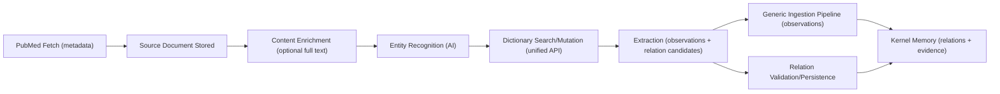

# PubMed to Graph Memory Orchestration

This document explains, in simple terms, how a PubMed paper becomes "memory" in the platform.

## What "memory" means here

In this system, memory is not one table. It is a coordinated set of stores:

- Dictionary (what concepts and relations are allowed)
- Kernel graph entities (who/what exists)
- Kernel graph observations (typed facts about entities)
- Kernel graph relations (edges between entities)
- Provenance/evidence (why we trust a fact or relation)

All memory is scoped to a research space.

Claim-first baseline:
- Every extracted triplet candidate is captured in the relation-claim ledger.
- Canonical graph relations are materialized projections of resolved support claims only.
- Persistable support candidates can materialize canonical graph relations as `DRAFT`; non-support claims never create canonical relations.
- Non-persistable candidates remain triage-only claims (not graph edges).

## Separation of concerns (who is responsible for what)

| Concern | Main owner | What it must do | What it must NOT do |
|---|---|---|---|
| Source fetch (PubMed connector) | PubMed ingestion service + adapter | Fetch PubMed records, normalize source metadata, inject `domain_context` | Decide graph relation policy |
| Full-text acquisition (optional) | Content enrichment service | Retrieve OA full text when available | Write graph relations directly |
| Dictionary search + writes | Dictionary management service (via unified harness) | Resolve terms, synonyms, vector/custom query when needed, create approved dictionary entries | Persist kernel entities/relations directly |
| Generic ingestion pipeline | Ingestion pipeline | Map -> normalize -> resolve -> validate -> persist observations | Contain source-specific policy branches |
| Relation/triplet persistence | Extraction relation persistence helpers | Validate candidate triples against constraints and governance mode; persist or queue review | Bypass dictionary constraints |
| Governance | Governance service + research-space settings | Decide write/review/shadow behavior | Replace dictionary validation |

Key boundary: source-specific behavior belongs in source services/adapters, not in shared pipeline internals.

## End-to-end flow

## Step-by-step in plain language

1. PubMed records are fetched.
- We ingest metadata like PMID/title/abstract/DOI.
- `domain_context` is normalized and attached by the PubMed path.

2. A source document is created.
- This is the durable record used by downstream AI stages.

3. Full text is enriched when available.
- Open-access full text is retrieved (PMC OA / Europe PMC paths).
- If unavailable, extraction can continue with title/abstract.

4. Entity recognition reads the document.
- It proposes entities, observations, and possible dictionary additions.
- Dictionary lookup is always done through one unified search API.

5. Dictionary decisions happen centrally.
- Deterministic search first; then vector/custom query if needed.
- If no good match exists, dictionary entries can be created under policy/governance.
- Domains must be approved and active (no typo-domain auto-creation).

6. Observations are written through the generic ingestion pipeline.
- The pipeline is source-agnostic.
- It maps payloads, normalizes values, resolves subject entities, validates constraints, and persists observations.

7. Relation candidates (triplet-like facts) are processed separately.
- Every candidate is first written to `relation_claims` (claim ledger).
- Claim semantics are first-class on each claim row:
  - `polarity`: `SUPPORT | REFUTE | UNCERTAIN | HYPOTHESIS`
  - `claim_text`: optional normalized claim sentence/span text
  - `claim_section`: optional paper section hint (for example `results`, `discussion`)
- Validation states classify each candidate:
  - `ALLOWED`, `FORBIDDEN`, `UNDEFINED`, `INVALID_COMPONENTS`, `ENDPOINT_UNRESOLVED`, `SELF_LOOP`.
- Persistability decides graph write behavior:
  - `PERSISTABLE`: resolved `SUPPORT` claims can materialize a canonical relation as `DRAFT`.
  - `NON_PERSISTABLE`: keep as claim only (no edge write).
- Curators triage claim rows with `OPEN`, `NEEDS_MAPPING`, `REJECTED`, `RESOLVED`.

8. Provenance/evidence is attached.
- Every persisted memory item carries traceable source context.
- Claim-level evidence is also persisted in `claim_evidence`:
  - one row per created claim, including sentence/rationale metadata
  - `sentence_source`: `verbatim_span | artana_generated`
  - `sentence_confidence`: `low | medium | high`
  - when no sentence is available, failure context is recorded in `metadata_payload`

## Claim semantics and conflict signals

Conflict detection is claim-driven and relation-scoped:

- Canonical explainability key: `relation_projection_sources`
- Compatibility pointer: `linked_relation_id`
- Conflict condition (v1): at least one `SUPPORT` claim and one `REFUTE` claim linked to the same canonical relation
- Exposed API: `GET /v1/spaces/{space_id}/relations/conflicts`
- Returned summary includes counts and claim IDs by polarity for curation triage

This keeps the canonical graph stable as a projection while allowing richer scientific disagreement modeling in claim space. `relation_evidence` is a derived cache built from linked support-claim evidence, not a separate truth store.

## What changes with `FULL_AUTO`

`FULL_AUTO` affects relation governance behavior, not the whole architecture.

- In `HUMAN_IN_LOOP`:
  - `UNDEFINED` and `FORBIDDEN` persistable relations are still written as `DRAFT`.
  - Constraint proposals are typically created as `PENDING_REVIEW` (dictionary review model).

- In `FULL_AUTO`:
  - System attempts to resolve `UNDEFINED` via mapping/constraint bootstrap before persistence.
  - Constraint creation policy is `ACTIVE`.
  - Persistable candidates still land as `DRAFT` for curator trust decisions.
  - Non-persistable safeguards (`INVALID_COMPONENTS`, `ENDPOINT_UNRESOLVED`, `SELF_LOOP`) stay claim-only.

What does not change:
- Source fetch and enrichment stages.
- Need for valid entities/endpoints.
- Domain approval rules for dictionary writes.
- Evidence/provenance handling.

## Design rules to keep the architecture clean

1. Shared pipeline must remain source-agnostic.
2. Source policy lives in source adapters/services.
3. Dictionary access must go through the unified dictionary API/harness.
4. Relation persistence must always consult dictionary constraints.
5. Governance mode can change automation level, but not core safety checks.
6. Public/manual graph creation should enter through claims; `POST /relations` is internal-only compatibility behavior.

## Practical mental model

Use this sentence:

"PubMed brings documents, Dictionary defines language, Extraction proposes facts, Governance decides write policy, and Kernel stores audited memory."

## Operational guardrails

1. Deploy order: migrations -> backend API -> web UI.
2. Normalization verification: run
`./venv/bin/python scripts/report_relation_status_normalization.py`
and confirm `PENDING_REVIEW remaining: 0`.
3. Claim-first telemetry emitted by backend:
- `claims_created_total`
- `claims_by_polarity_total`
- `claims_non_persistable_total`
- `claim_evidence_rows_created_total`
- `relations_draft_created_total`
- `relations_conflict_detected_total`
- `curation_queue_relation_claim_total`
- `graph_filter_preset_usage`
4. Non-persistable spike alert:
- backend emits `claim_non_persistable_ratio_spike` warning logs when the ratio exceeds configured threshold.
- optional per-space settings:
  - `claim_non_persistable_baseline_ratio`
  - `claim_non_persistable_alert_ratio`

## Historical limitation

Triplets dropped by legacy behavior before claim-first rollout cannot be reconstructed retroactively. Claim-first guarantees start from this rollout forward.
